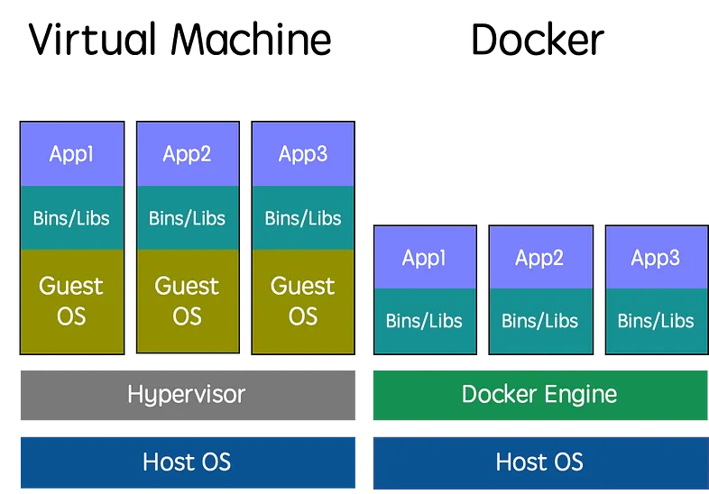
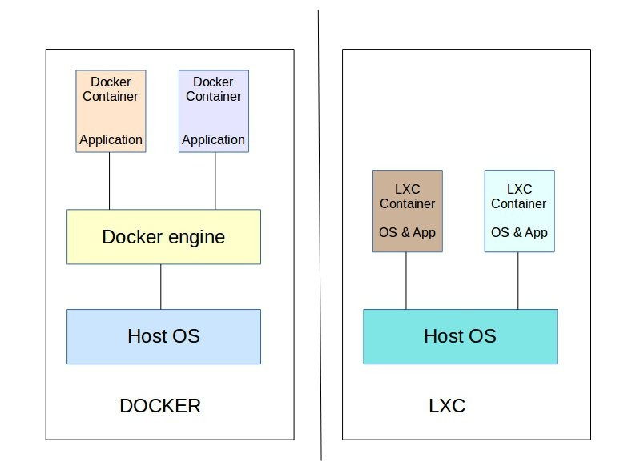

# 虛擬機 vs 容器

## 1. 虛擬機 (VirtualMachine)

虛擬機是**模擬**一台完整電腦的軟體，它有自己的虛擬硬體、作業系統、核心、函式庫和應用程式。透過 Hypervisor 在實體主機上創建多個虛擬機，每個虛擬機都像一台獨立的電腦一樣運作。

優點：

- **隔離性強：** 每個虛擬機之間完全隔離，互不影響。
- **靈活性高：** 可以安裝不同的作業系統，適用於各種應用程式。
- **安全性較高：** 由於隔離性強，一個虛擬機的崩潰不會影響其他虛擬機。
 
缺點：

- **資源消耗大：** 每個虛擬機都需要完整的作業系統，佔用大量硬體資源。
- **啟動速度慢：** 虛擬機啟動需要載入完整的作業系統，速度較慢。

常見 VM 管理軟體: Virtualbox、VMware Workstation、**Proxmox Virtual Environment** (KVM)  

## 2. 容器（Containers）

容器是一種**輕量級**的虛擬化技術，它**共享**主機作業系統的核心，但有自己的檔案系統、函式庫和應用程式。透過容器引擎（如 Docker、 LXC ）在主機作業系統上創建多個容器，每個容器共享主機核心，但彼此隔離。
優點：
	- **資源消耗小：** 容器共享主機核心，資源消耗比虛擬機少。
	- **啟動速度快：** 容器啟動速度比虛擬機快，通常只需幾秒鐘。
	- **部署方便：** 容器易於打包和部署。
缺點：
	- **隔離性較弱：** 容器共享主機核心，隔離性不如虛擬機強。
	- **靈活性較低：** 容器只能運行與主機作業系統相容的應用程式。
	- **安全性較低：** 由於共享核心，一個容器的漏洞可能影響其他容器。

常見 Container: Doker、**Proxmox Virtual Environment** (LXC)

### 2.1. Docker vs LXC

常見 VM: Virtualbox、VMware Workstation、**Proxmox Virtual Environment** (KVM)  
常見 Container: Doker、**Proxmox Virtual Environment** (LXC)

