---
tags:
  - virtualbox
  - ubuntu_24_04
軟體版本: VirtualBox 7.1.6 Lubuntu 22.04
---
# 使用 Virtual Box 安裝 Lubuntu 24.04

## 1. 製作 lubuntu 安裝開機 usb

>[!Info]
>這一步驟是要在實體電腦安裝 Lubuntu 才需要製作 Lubuntu 的開機usb，如果是要用 VirtualBox 安裝虛擬機器，則只要下載 lubuntu iso即可。

到 Lubuntu 官網 [https://lubuntu.me/downloads/](https://lubuntu.me/downloads/) 下載 lubuntu 26.04 iso 檔，使用 rusuf [ https://rufus.ie/zh_TW/](https://rufus.ie/zh_TW/)  軟體製作 usb 開機碟。

## 2. 安裝 VirtualBox 虛擬機管理系統

到 VirtualBox 官網下載 VirtualBox安裝檔，下載後執行安裝並執行 VirtualBox
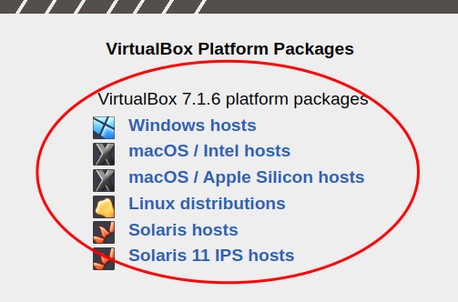

開啟 VirtualBox 後，我們新增一台虛擬機（以後可能**會使用 VM 代表虛擬機**），用來安裝 Lubuntu

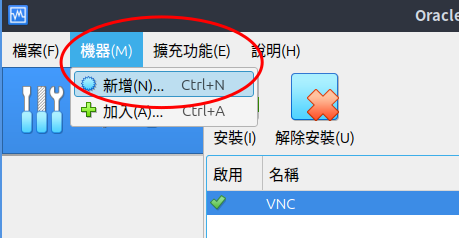

自取一個虛擬機名稱、檔案系統要放置的資料夾位置以及要用來安裝這台機器的作業系統安裝光碟 iso 

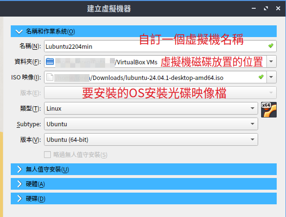

這個 OS 不支援無人值守安裝，所以這分頁都不能設定

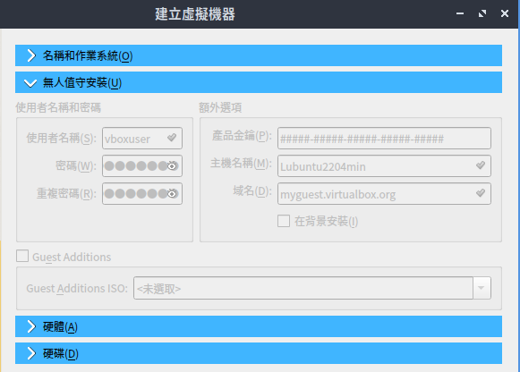

要分配給這台虛擬機的記憶體及CPU，依系統資源決定，給越多虛擬機就會跑得越順暢。給虛擬機的資源，以後隨時都可以更改。

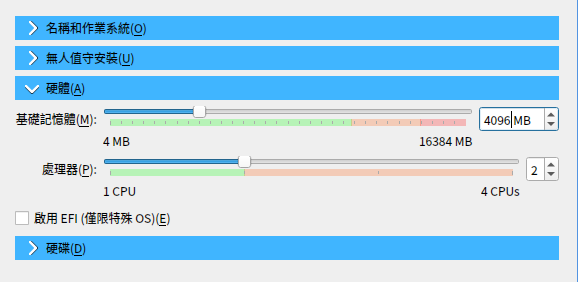

>[!Tip]
>【預先配置完整大小】建議勾選，勾選後表示虛擬硬碟的檔案會直接預分配我們設定的25G，如果不勾選，則虛擬硬碟會依據我們系統需要的空間，**慢慢變大**。
>有沒有預分配，在磁碟寫入的時候，經測試寫入速度會相差到5～10倍。

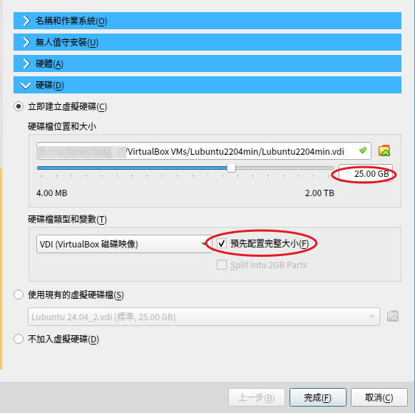

按下完成，我們就建好我們的虛擬機器，接著點選建立好的虛擬機，按下<啟動按鈕>就會啟動這個虛擬機

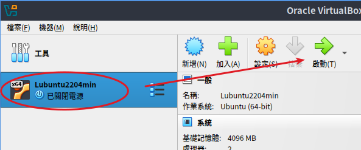


>[!Tip]
>啟動後右方會出現一些提示訊息，我們可以關閉這個訊息。第一個提示訊息很重要，當虛擬機的視窗取得焦點時，會自動攔截我們的滑鼠以及鍵盤操作，然後傳送給虛擬機。   
>如果我們按下「右 Ctrl」則會變成傳統（非自動擷取）模式，整個滑鼠鍵盤都會被限制在虛擬機的區域，變成沒辦法操作主控機(Host)的作業系統，一樣可以按下「右 Ctrl」會恢復成「自動擷取模式」，大家可以試試看差別。

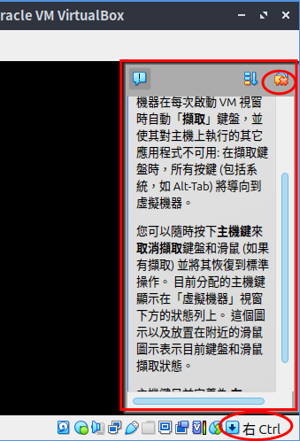


## 3. 安裝 Lubuntu
* 使用 usb 開機，執行第一個選項，就會先以 live cd 的模式進入 lubuntu 作業系統的界面

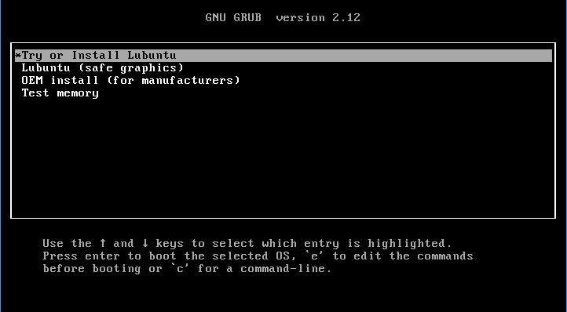

* 點選 「 Install Lubuntu 」
 
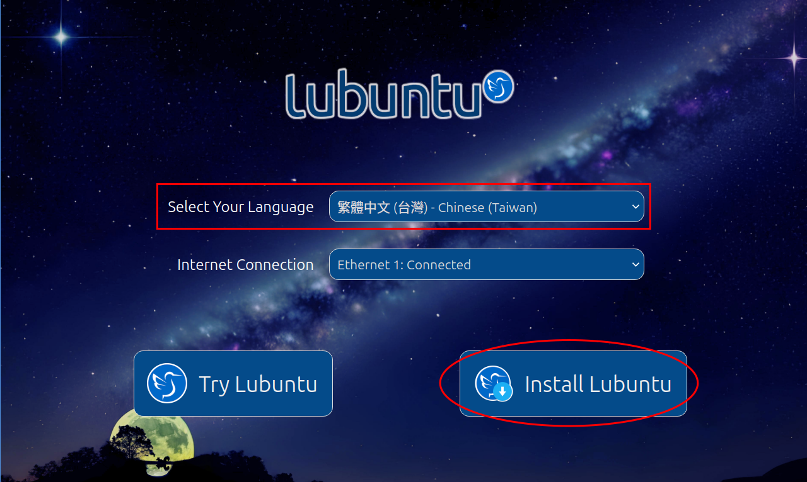

* 依照安裝指示**一直按下一步**即可，以下僅顯示需要做選擇或輸入的部份提示
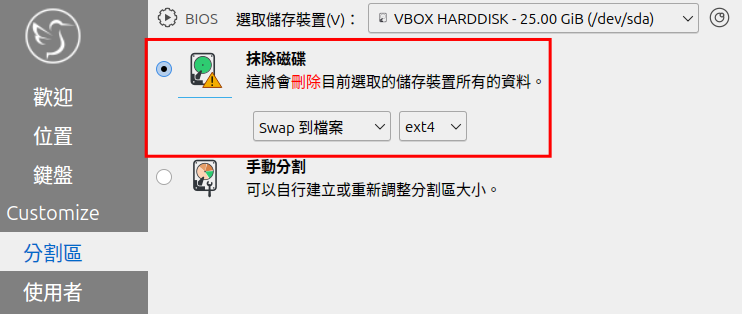

* ubuntu 的衍生套件預設 **不啟用 root 帳號**，必須建一個自取帳號名稱的一般帳號，避免惡意程式一開始就知道要用 root 去暴力破解密碼。這裡我們將帳號、密碼都設定為 **「user」**
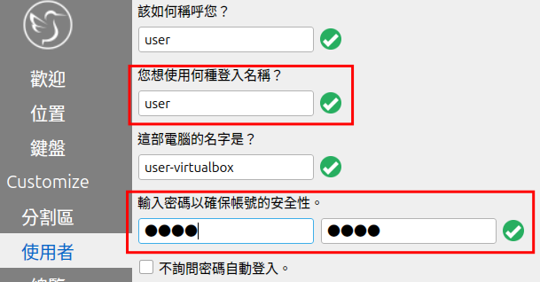

安裝完成後，會提醒我們移除 OS 安裝光碟(使用虛擬機不需要這個動作)，**必須按下 Enter** 才會重新開機。

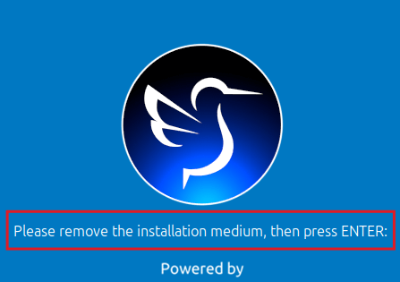

## 4. 安裝 Guest Additions

為了讓 host主控端要跟虛擬機（guest端）做進階的功能聯繫(剪貼簿互通、顯示驅動...等)，所以虛擬機的 Guest OS 需要安裝 virtualbox 的 guest addition 程式。
先從虛擬機視窗功能選單執行【裝置/插入 Guest Additions CD映像】。

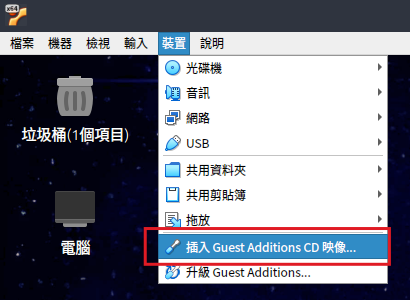


使用「檔案總管」開啟插入的光碟內容，我們要執行裡面的  VBoxLinuxAdditions.run
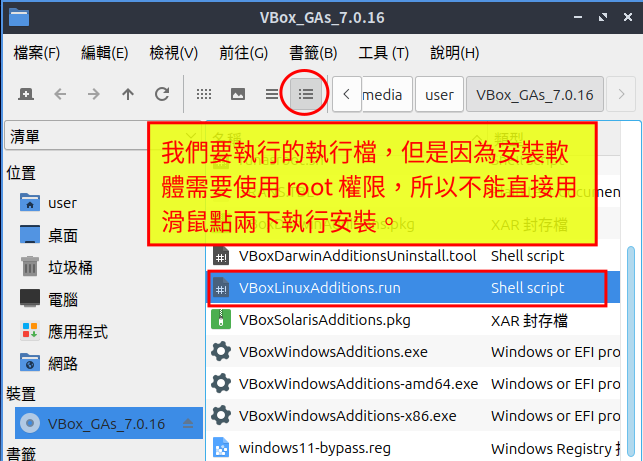

因為必須使用 root 權限執行，我們可以開啟終端機視窗，從「檔案總管」開啟終端機視窗，會直接跳到目前所在目錄。

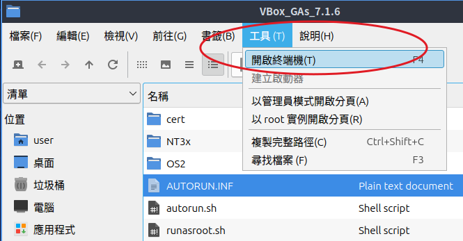


>[!Tip]
>sudo 允許一般用戶以 root 或其他特定帳號權限執行程式，使用 sudo 會詢問使用者的密碼，這時候請輸入目前使用者(user) 的密碼，不是輸入 root 密碼，因為 Lubuntu 沒有啟用 root 帳號。

「在終端機視窗」執行以下命令，安裝編譯核心模組需要的相關程式以及安裝 VBoxGuestAddition
```bash title="Shell"
sudo apt update
sudo apt install build-essential
sudo ./VBoxLinuxAdditions.run
```

安裝完成後開啟雙向剪貼簿功能
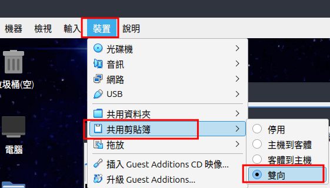
接著請**重新開機**，重開機後 guest 就支援畫面更大的解析度，以及 host 跟 guest 雙向剪貼簿功能，可以在一邊複製後，貼到另一邊。

## 5. Lubuntu 軟體安裝

### 5.1. 安裝 ssh server

開啟終端機（命令列）視窗內

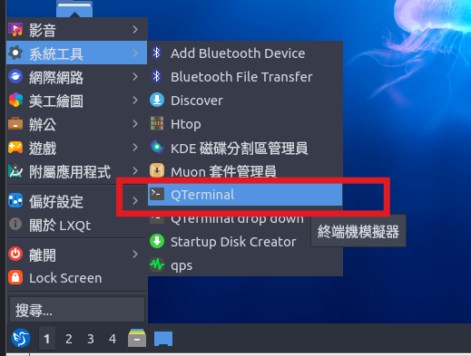


apt 是 ubuntu 、 debian 系統命令列的套件安裝管理程式。執行以下指令安裝「 openssh-server」

```bash title="Shell"
sudo apt install openssh-server
```

### 5.2. 安裝中文輸入法及補齊中文翻譯

執行以下指令安裝「 fcitx + 新酷音」中文輸入法  。 

```bash title="Shell"
sudo apt install fcitx5-chewing
```

執行 【fcitx5設定 】啟用新酷音輸入法，確定後可能需要重新登入才能正常使用。
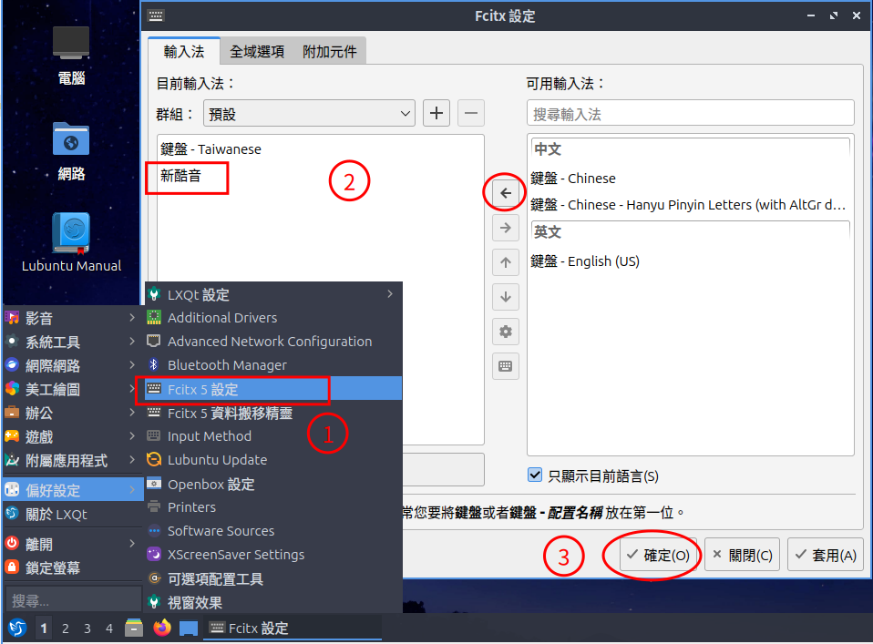

因為 Lubuntu 比較輕量，有些繁體中文翻譯套件預設沒安裝，我們順便將它補齊
```bash title="Shell"
sudo apt install language-pack-zh-hant language-pack-gnome-zh-hant language-pack-kde-zh-hant libreoffice-l10n-zh-tw firefox-locale-zh-hant
```

### 5.3. 使用 GUI 界面安裝各種軟體

如果不想用命令列安裝軟體，我們可以使用 Lubuntu 24.04 預設的GUI軟體安裝管理程式稱為 Discover

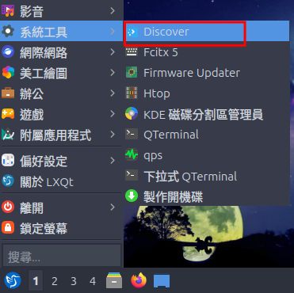

使用 Discover 就可以方便的搜尋、安裝各種應用程式。也可以一鍵更新系統已經安裝的套件及軟體。
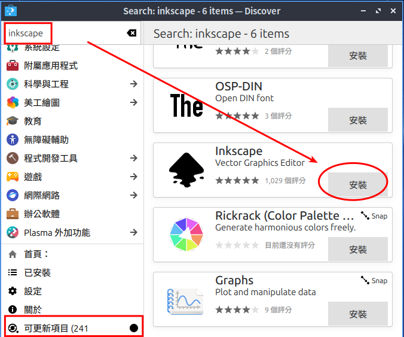

>[!tip]
>另外一個我最喜歡使用的套件管理程式是 Synaptic，也推薦大家使用看看
>```bash title="Shell"
>sudo apt install synaptic apt-xapian-index
>```

### 5.4. 常用軟體推薦，請試著自己安裝看看

gimp、inkscape、krita、audacity、blender... 
我就喜歡這種 linux 跟 windows 都有的應用程式，用久就會發現==用什麼「作業系統」不是重點，應用程式才是。==


### 5.5. 網路介面卡設定

點擊 Lubuntu 右下角的網路圖示按下滑鼠右鍵++right-button++，可以設定我們這台主機要使用的 ip，預設是使用 dhcp ，如有需要可以在這裡做修改。

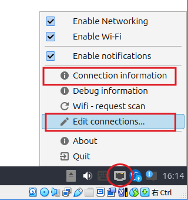

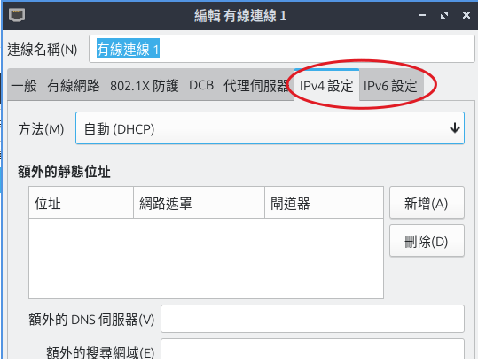

## 6. 建立虛擬機快照

虛擬通常是用來測試新軟體或環境，我們可以在任意階段將虛擬機建立一個快照，萬一系統損壞可以很容易的回存到某個狀態。
例如我們目前的 Lubuntu 就是已經完成最基礎的 Linux安裝，以及中文環境設定，這時候我們就可以將系統做快照，除了做復原以外，我們還可以用這個快照建立新的虛擬機，可以省去安裝 Linux 跟這些設定的過程。
建立快照前要先將虛擬機關機。使用 VirtualBox 管理員，開啟虛擬機的快照功能頁面

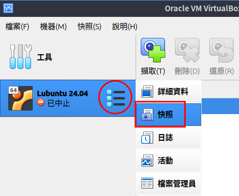

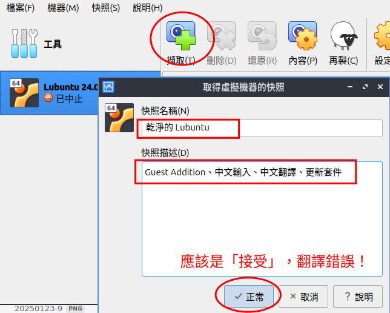

快照可以隨時建立，建好快照後我們可以將虛擬機還原到某個快照點，或是可以將使用快照建立一個全新獨立的虛擬機

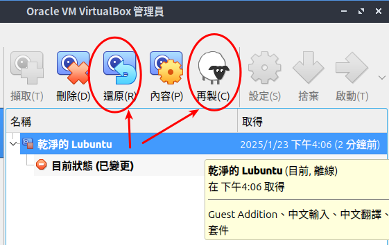

## 7. 打包虛擬機

我們可以把前面完成的虛擬機打包成一個檔案，只要帶著這個檔案，就可以隨時回復出一模一樣的機器出來，這也是虛擬機的好處：可以隨時複製、打包、復原機器....
快照可以當作單機備份，打包可以想像成獨立備份，兩個功能其實也些許重複性質。不過打包後會變成一個檔案，會比較容易攜帶或分享。

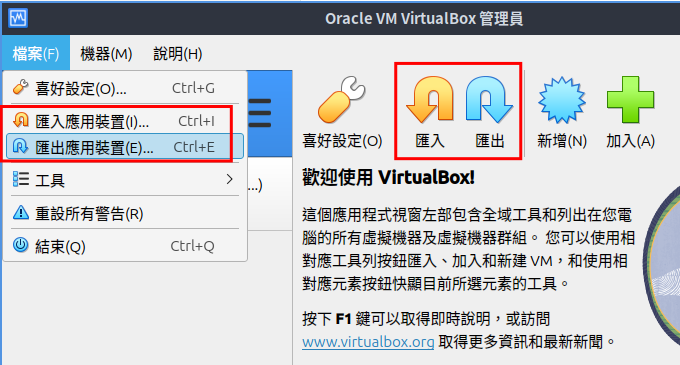

使用【檔案/匯出應用裝置】，格式請選擇新的「**Open Virtualization Format 2.0**」格式，就可以將虛擬機匯出成一個 .ova檔案。

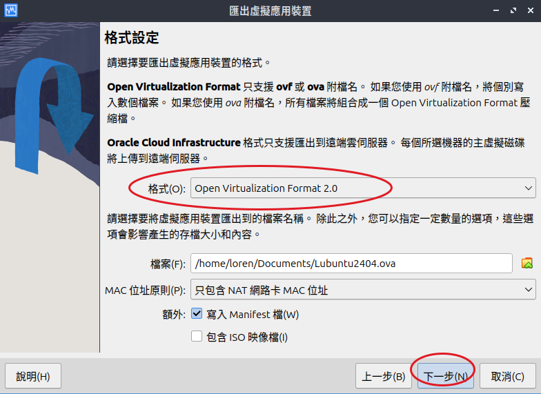

## 8. 匯入虛擬機

使用【檔案/匯入應用裝置】就可以將匯入 .ova 檔案，變成一台獨立的虛擬機。
在匯出 ova 時我們有將虛擬機的 MAC 儲存在 .ova 檔案中，如果是用來做機器復原，我們可以選擇保留網路卡的 MAC，如果是用來建立出一個獨立的新虛擬機器，則建議選擇「**為所有網路卡產生新的MAC位址**」，以免新機器的網卡 MAC address 跟其他虛擬機重複。


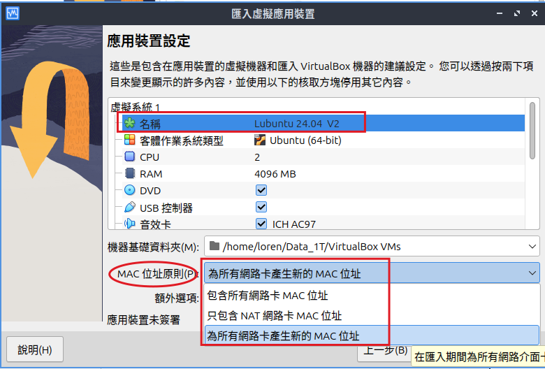

按下完成就會產生一台新的虛擬機了。
