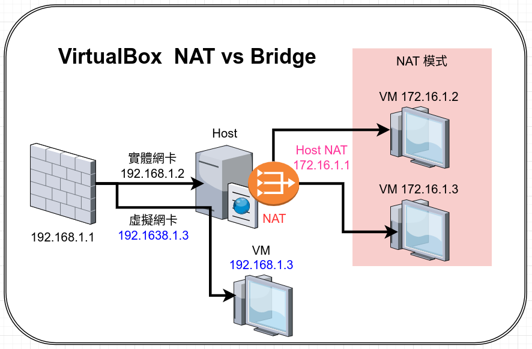
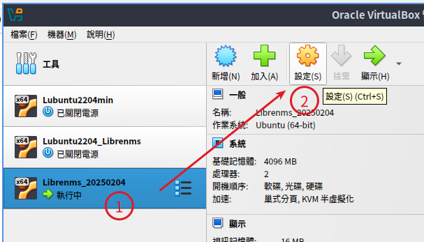
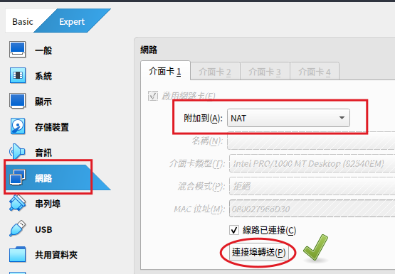
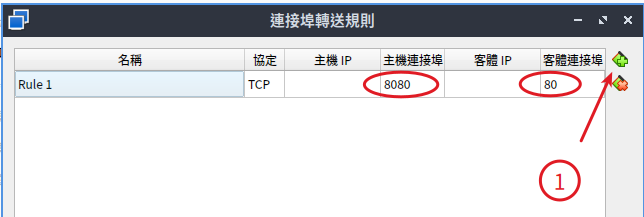
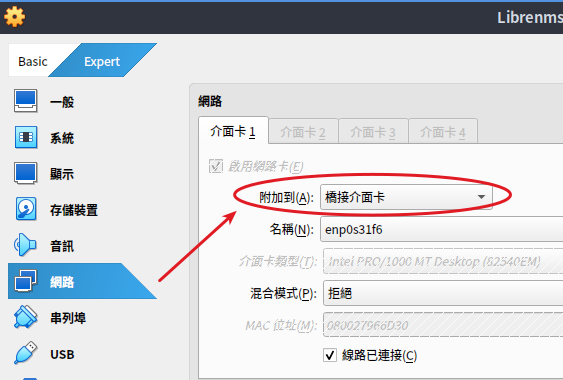

# VirtualBox 網路設定

## 1. NAT vs 橋接網路

虛擬機的網路有兩種主要常用的設定: ==NAT== 與 ==橋接模式==，預設是使用 NAT 網路

NAT 網路：

- 會建立一個不同的網路，並且主機透過一個虛擬網路卡連接到該網路。
- 透過 NAT 連接的虛擬機器，除非手動橋接（**使用連接埠映對**），否則無法從外部（真實）網路存取。

橋接網路：

- 在主機上建立一個虛擬網路卡，它會將虛擬機器的流量透過它傳輸。
- 虛擬機器可以直接設定 ip 連線到外部網路。
- 外部電腦也可以直接連線到虛擬機。

如果我們從 Host 主機或外面的電腦，要連線到 VM ，針對兩種不同網路設定有不同作法

## 2. NAT

假設虛擬機是使用預設的 NAT 模式，我們必須對 VM 進行 port 轉送

設定完成後，當我們在 Host主機的瀏覽器連線到 http://localhost:8080 就等於是連線到剛設定那台 VM 的 80 port，也就是連線到 VM 的 http://localhost 。

如果是外部網路要連線到 VM ，以上圖為例就是連線到 http://192.168.1.2:8080 這樣就可以連線到 VM 的 80port 了。

## 3. 橋接網路

如果不想用連接埠轉送或是希望能設定 ipv4 跟 ipv6 ，建議改用橋接網路方式，讓虛擬機有一個獨立 ip，這樣從外部網路看， VM 跟一般主機就沒有什麼不同了。

一樣從剛剛 VM 的網路設定，將 NAT 改為橋接介面卡。另外還要進 VM 區設定 VM 要使用的 ip （以上圖為例就是 192.168.1.3 ），這樣外部就可以直接以 192.168.1.3 連線到 VM 了。
