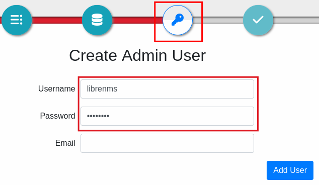

# 使用 Docker 快速安裝 librenms

## 1. 安裝 Docker Engine

> [!Info]
> 如果是在 Windows下已安裝 wsl2 ubuntu 及 Docker Desktop(並開啟整合至 wsl2)，就不需要在 WSL2 的 ubuntu 內另外安裝 docker engine，請直接跳過本步驟。

1. 設定 docker 軟體來源
```bash
# Add Docker's official GPG key:
sudo apt-get update
sudo apt-get install ca-certificates curl
sudo install -m 0755 -d /etc/apt/keyrings
sudo curl -fsSL https://download.docker.com/linux/ubuntu/gpg -o /etc/apt/keyrings/docker.asc
sudo chmod a+r /etc/apt/keyrings/docker.asc

# Add the repository to Apt sources:
echo \
  "deb [arch=$(dpkg --print-architecture) signed-by=/etc/apt/keyrings/docker.asc] https://download.docker.com/linux/ubuntu \
  $(. /etc/os-release && echo "${UBUNTU_CODENAME:-$VERSION_CODENAME}") stable" | \
  sudo tee /etc/apt/sources.list.d/docker.list > /dev/null
sudo apt-get update
```

2. 安裝 docker 套件
```bash
sudo apt-get install docker-ce docker-ce-cli containerd.io docker-buildx-plugin docker-compose-plugin
```

3. 測試 docker 是否安裝成功，下面指令會執行測試用的 docker 程式，如果可以正常並顯示歡迎訊息，就表示 docker engine 已經安裝成功
```bash
 sudo docker run hello-world
```

## 2. 使用 docker 執行 librenms

1. 下載並解壓縮 librenms 的 composer 檔：
```bash
sudo apt install unzip
mkdir librenms
cd librenms
wget https://github.com/librenms/docker/archive/refs/heads/master.zip
unzip master.zip
cd docker-master/examples/compose
```
2.　啟動 Librenms 前，我們可以先預做修改以下兩個檔案的設定

設定時區
```Text title=".env"
TZ=Asia/Taipei
```

修改為用來寄送通知的寄送者 mail
```Text title="msmtpd.env"
SMTP_FROM=librenms@gmail.com
```


3. 啟動 Docker 容器
```bash
sudo docker compose -f compose.yml up -d
```

4. 開啟瀏覽器連線到  http://localhost:8000  （如果有外部 ip，建議使用外部 ip不要使用 localhost），設定我們要使用的 librenms 帳號密碼，這裡我們都設定為 librenms:librenms



3. 完成安裝....

## 3. 備份或遷移使用 docker 安裝的 Librenms

依照預設安裝路徑，我們只要備份　docker-master/examples/compose　這個資料夾即可將整個 librenms 備份或帶走，只要複製到另一個 Linux 主機或系統，再執行前面步驟2方式啟動 Docker 容器，整個 librenms 就恢復了。

因為資料夾內有系統使用者建立的儲存資料，所以我們要打包資料夾，必須用 sudo 打包
```bash  title="Shell"
 sudo tar -zcvf compose.tar.gz compose
```
解壓縮
```bash title="Shell"
tar -zxvf compose.tar.gz
```

## 4. 讓 Docker Engine支援 ipv6

>[!Tip]
>使用 Docker Desktop 不需要這個步驟
### 4.1. 修改 docker 主程式設定 daemon.json

1. 編輯 /etc/docker/daemon.json ，加入以下內容
```JSON title="JSON"
{
  "ipv6": true,
  "fixed-cidr-v6": "2001:db8:1::/64",
  "ip-forward": true
}
```

2. 重新啟動 Docker 服務

```shell title="Shell"
sudo systemctl restart docker
```

### 4.2. 修改 librenms 提供的 compose.yml

1. 將整個檔案替換成以下內容：
```YAML title="compose.yml"
name: librenms

services:
  db:
    image: mariadb:10
    container_name: librenms_db
    command:
      - "mysqld"
      - "--innodb-file-per-table=1"
      - "--lower-case-table-names=0"
      - "--character-set-server=utf8mb4"
      - "--collation-server=utf8mb4_unicode_ci"
    volumes:
      - "./db:/var/lib/mysql"
    environment:
      - "TZ=${TZ}"
      - "MARIADB_RANDOM_ROOT_PASSWORD=yes"
      - "MYSQL_DATABASE=${MYSQL_DATABASE}"
      - "MYSQL_USER=${MYSQL_USER}"
      - "MYSQL_PASSWORD=${MYSQL_PASSWORD}"
    restart: always
    networks:
      - librenms_net # 連接到支援 IPv6 的網路

  redis:
    image: redis:7.2-alpine
    container_name: librenms_redis
    environment:
      - "TZ=${TZ}"
    restart: always
    networks:
      - librenms_net # 連接到支援 IPv6 的網路

  msmtpd:
    image: crazymax/msmtpd:latest
    container_name: librenms_msmtpd
    env_file:
      - "./msmtpd.env"
    restart: always
    networks:
      - librenms_net # 連接到支援 IPv6 的網路

  librenms:
    image: librenms/librenms:latest
    container_name: librenms
    hostname: librenms
    cap_add:
      - NET_ADMIN
      - NET_RAW
    ports:
      - target: 8000
        published: 8000
        protocol: tcp
    depends_on:
      - db
      - redis
      - msmtpd
    volumes:
      - "./librenms:/data"
    env_file:
      - "./librenms.env"
    environment:
      - "TZ=${TZ}"
      - "PUID=${PUID}"
      - "PGID=${PGID}"
      - "DB_HOST=db"
      - "DB_NAME=${MYSQL_DATABASE}"
      - "DB_USER=${MYSQL_USER}"
      - "DB_PASSWORD=${MYSQL_PASSWORD}"
      - "DB_TIMEOUT=60"
    restart: always
    networks:
      - librenms_net # 連接到支援 IPv6 的網路

  dispatcher:
    image: librenms/librenms:latest
    container_name: librenms_dispatcher
    hostname: librenms-dispatcher
    cap_add:
      - NET_ADMIN
      - NET_RAW
    depends_on:
      - librenms
      - redis
    volumes:
      - "./librenms:/data"
    env_file:
      - "./librenms.env"
    environment:
      - "TZ=${TZ}"
      - "PUID=${PUID}"
      - "PGID=${PGID}"
      - "DB_HOST=db"
      - "DB_NAME=${MYSQL_DATABASE}"
      - "DB_USER=${MYSQL_USER}"
      - "DB_PASSWORD=${MYSQL_PASSWORD}"
      - "DB_TIMEOUT=60"
      - "DISPATCHER_NODE_ID=dispatcher1"
      - "SIDECAR_DISPATCHER=1"
    restart: always
    networks:
      - librenms_net # 連接到支援 IPv6 的網路

  syslogng:
    image: librenms/librenms:latest
    container_name: librenms_syslogng
    hostname: librenms-syslogng
    cap_add:
      - NET_ADMIN
      - NET_RAW
    depends_on:
      - librenms
      - redis
    ports:
      - target: 514
        published: 514
        protocol: tcp
      - target: 514
        published: 514
        protocol: udp
    volumes:
      - "./librenms:/data"
    env_file:
      - "./librenms.env"
    environment:
      - "TZ=${TZ}"
      - "PUID=${PUID}"
      - "PGID=${PGID}"
      - "DB_HOST=db"
      - "DB_NAME=${MYSQL_DATABASE}"
      - "DB_USER=${MYSQL_USER}"
      - "DB_PASSWORD=${MYSQL_PASSWORD}"
      - "DB_TIMEOUT=60"
      - "SIDECAR_SYSLOGNG=1"
    restart: always
    networks:
      - librenms_net # 連接到支援 IPv6 的網路

  snmptrapd:
    image: librenms/librenms:latest
    container_name: librenms_snmptrapd
    hostname: librenms-snmptrapd
    cap_add:
      - NET_ADMIN
      - NET_RAW
    depends_on:
      - librenms
      - redis
    ports:
      - target: 162
        published: 162
        protocol: tcp
      - target: 162
        published: 162
        protocol: udp
    volumes:
      - "./librenms:/data"
    env_file:
      - "./librenms.env"
    environment:
      - "TZ=${TZ}"
      - "PUID=${PUID}"
      - "PGID=${PGID}"
      - "DB_HOST=db"
      - "DB_NAME=${MYSQL_DATABASE}"
      - "DB_USER=${MYSQL_USER}"
      - "DB_PASSWORD=${MYSQL_PASSWORD}"
      - "DB_TIMEOUT=60"
      - "SIDECAR_SNMPTRAPD=1"
    restart: always
    networks:
      - librenms_net # 連接到支援 IPv6 的網路

networks:
  librenms_net:
    enable_ipv6: true
    ipam:
      driver: default
```

2. 重新啟動 librenms  compose
```bash
sudo docker compose -f compose.yml restart
```


## 5. 進入 docker 容器的 shell 環境

```bash
sudo docker exec -i -t librenms /bin/bash
```
