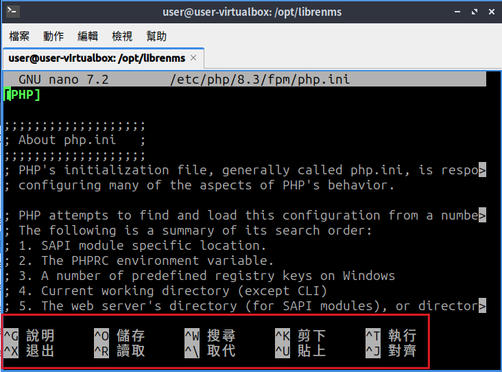
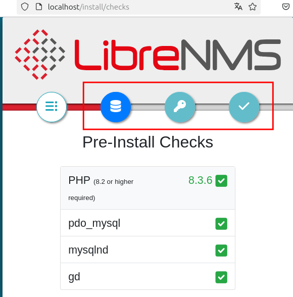
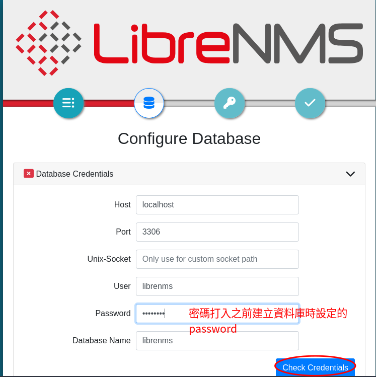
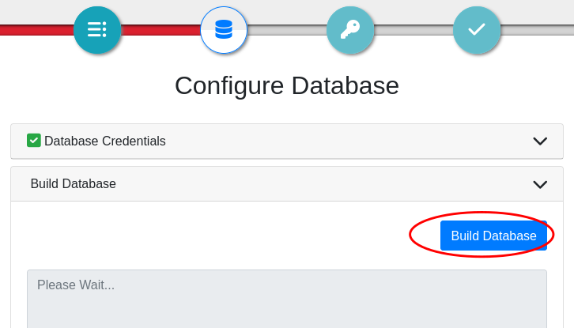
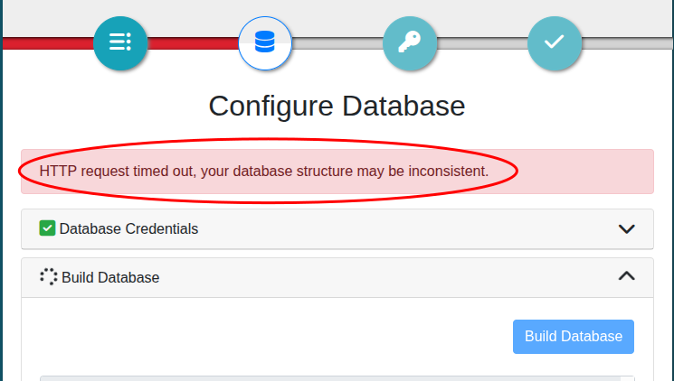
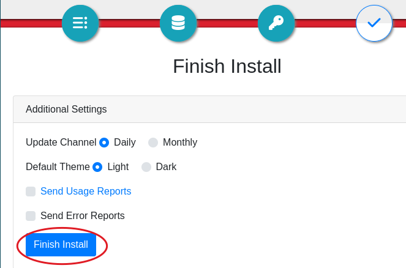

# 安裝 Librenms 在 Lubuntu 24.04

官方安裝說明文件[^1]

> [!info]
>
> 1. 先安裝好 Lubuntu 24.04 ，假設安裝時自訂的 Linux 系統使用者帳號密碼為 **【user:user】**
> 2. 以下使用一般使用者命令列方式做安裝示範，所以安裝指令前都會加上 sudo，如果是使用 root 帳號，則 sudo 可以省略

## 1. 安裝必要的套件

```bash
sudo apt update
sudo apt install acl curl fping git graphviz imagemagick mariadb-client mariadb-server mtr-tiny nginx-full nmap php-cli php-curl php-fpm php-gd php-gmp php-json php-mbstring php-mysql php-snmp php-xml php-zip rrdtool snmp snmpd unzip python3-command-runner python3-pymysql python3-dotenv python3-redis python3-setuptools python3-psutil python3-systemd python3-pip whois traceroute
```

## 2. 新增 librenms 使用者

```bash
sudo useradd librenms -d /opt/librenms -M -r -s "$(which bash)"
```

## 3. 下載 LibreNMS

```bash
cd /opt
sudo git clone https://github.com/librenms/librenms.git
```

## 4. 設定檔案權限

```bash
sudo chown -R librenms:librenms /opt/librenms
sudo chmod 771 /opt/librenms
sudo setfacl -d -m g::rwx /opt/librenms/rrd /opt/librenms/logs /opt/librenms/bootstrap/cache/ /opt/librenms/storage/
sudo setfacl -R -m g::rwx /opt/librenms/rrd /opt/librenms/logs /opt/librenms/bootstrap/cache/ /opt/librenms/storage/
```

## 5. 安裝 PHP 相依性管理工具(composer)

```bash
cd /opt/librenms
sudo -u librenms ./scripts/composer_wrapper.php install --no-dev
```

## 6. 設定時區

### 6.1. php時區

編輯 /etc/php/8.5/fpm/php.ini 和 /etc/php/8.5/cli/php.ini 兩個檔案（須有管理權限）。

> [!Tip]
> 編輯系統的文字檔（配置檔）可以使用文字編輯器， 在命令列視窗下，可以使用 vi 或 nano 來編輯文字檔，這裡推薦使用 nano 會比較容易操作。例如要編輯上述的檔案可以使用
> `sudo nano /etc/php/8.5/fpm/php.ini`
> `sudo nano /etc/php/8.5/cli/php.ini`
>
> 
>
> nano 的命令提示顯示在下方，例如要存檔就是使用 ++ctrl+o++... 不用背是不是很方便 :)

PHP 設定檔支援的時區，請參閱 [https://php.net/manual/en/timezones.php](https://php.net/manual/en/timezones.php)
在**上述兩個檔案**中，找到 ;date.timezone = 這一行的設定，將前面的分號（註解）去掉，將設定改成
`date.timezone = Asia/Taipei`

### 6.2. 作業系統時區

```
sudo timedatectl set-timezone Asia/Taipei
```

## 7. 配置 MariaDB

編輯 /etc/mysql/mariadb.conf.d/50-server.cnf 配置檔
在  `[mysqld]` 區塊內加入以下設定( **`[mysqld]` 已經在設定檔內，不需要輸入**)

```
[mysqld]
innodb_file_per_table=1
lower_case_table_names=0
```

儲存配置檔，然後重新啟動 MariaDB 資料庫系統

```bash
sudo systemctl enable mariadb
sudo systemctl restart mariadb

```

執行 MariaDB(MySql) 文字客戶端界面，我們要建立 Librenms 所需要的資料庫跟資料表

```bash
sudo mysql -u root
```

> [!note]
> 下面是建立資料庫相關的 sql script 指令腳本，在 **MySql 文字客戶端界面下** (不是 Linux 的命令列環境下)貼上下面的 script，==執行完腳本之後會自動退出到 Linux 的命令列==
>
> 如果為了安全性可以將 'password' 改成你要使用的資料庫存取密碼，記住這個密碼，後面的網頁安裝步驟會用到

```
CREATE DATABASE librenms CHARACTER SET utf8mb4 COLLATE utf8mb4_unicode_ci;
CREATE USER 'librenms'@'localhost' IDENTIFIED BY 'password';
GRANT ALL PRIVILEGES ON librenms.* TO 'librenms'@'localhost';
use librenms;
source /opt/librenms/database/schema/mysql-schema.sql;
exit

```

## 8. 配置 PHP-FPM

複製 www.conf 為範本到新配置檔 librenms.conf

```bash
sudo cp /etc/php/8.3/fpm/pool.d/www.conf /etc/php/8.3/fpm/pool.d/librenms.conf
```

編輯 /etc/php/8.3/fpm/pool.d/librenms.conf
**將檔案內的 `[www]` 改為 `[librenms]`**

將 `user` 和  `group` 設定改為 **librenms**(原來是設定為 `www-data`)

```
user = librenms
group = librenms
```

將 `listen` 後面改為唯一不重複的路徑，這個路徑要跟 WWW Server的設定一致，原設定為 /run/php/php8.5-fpm.sock ，這裡我們改為 **/run/php-fpm-librenms.sock**

```
listen = /run/php-fpm-librenms.sock
```

> [!Tip]
> 如果這機器沒有其他 PHP 網頁應用程式，可以刪除 www.conf 來節省一些系統資源。

## 9. 組態 Nginx Web Server

編輯 /etc/nginx/sites-available/default **將檔案內容清空**，直接以下面的內容取代

```nginx
server {
	listen 80 default_server;
	listen [::]:80 default_server;
	server_name localhost;
	root /opt/librenms/html;
	index       index.php;
	charset utf-8;
	gzip on;
	gzip_types text/css application/javascript text/javascript application/x-javascript image/svg+xml text/plain text/xsd text/xsl text/xml image/x-icon;
	location / {
		try_files $uri $uri/ /index.php?$query_string;
	}
	location ~ [^/]\.php(/|$) {
		fastcgi_pass unix:/run/php-fpm-librenms.sock;
		fastcgi_split_path_info ^(.+\.php)(/.+)$;
		include fastcgi.conf;
	}
	location ~ /\.(?!well-known).* {
		deny all;
	}
}
```

存檔後重新啟動 nginx 網頁伺服器

```bash
sudo systemctl restart nginx
sudo systemctl restart php8.3-fpm
```

## 10. 啟用 lnms 命令自動完成

這個動作可以讓 lnms 命令跟一般 Linux 命令一樣，使用 Tab 鍵可以自動補齊完整指令。

```bash
sudo ln -s /opt/librenms/lnms /usr/bin/lnms
sudo cp /opt/librenms/misc/lnms-completion.bash /etc/bash_completion.d/
```

## 11. 配置 snmpd

複製 librenms 提供的 snmpd 設定範本

```
sudo cp /opt/librenms/snmpd.conf.example /etc/snmp/snmpd.conf
sudo chmod 755 /etc/snmp/snmpd.conf
```

編輯 /etc/snmp/snmpd.conf 設定檔，將檔案內的 RANDOMSTRINGGOESHERE 字串修改為 public 或是自訂的 snmp 社群字串(密碼)

重啟 snmpd 服務

```bash
sudo curl -o /usr/bin/distro https://raw.githubusercontent.com/librenms/librenms-agent/master/snmp/distro chmod +x /usr/bin/distro
sudo systemctl enable snmpd
sudo systemctl restart snmpd
```

## 12. 設定定時工作(Cron job)

```bash
sudo cp /opt/librenms/dist/librenms.cron /etc/cron.d/librenms
```

## 13. 啟用排程

```bash
sudo cp /opt/librenms/dist/librenms-scheduler.service /opt/librenms/dist/librenms-scheduler.timer /etc/systemd/system/

sudo systemctl enable librenms-scheduler.timer
sudo systemctl start librenms-scheduler.timer
```

## 14. 複製日誌 (logrotate) 滾動分割設定

logrotate 是一個Unix/Linux 系統上的日誌管理工具，它的主要功能是自動輪轉、壓縮和刪除日誌文件，透過定期輪轉日誌文件，防止日誌文件變得過大。
LibreNMS 將日誌紀錄儲存在 `/opt/librenms/logs` 這目錄，複製設定檔讓作業系統 幫我們做 logrotate 動作。

```bash
sudo cp /opt/librenms/misc/librenms.logrotate /etc/logrotate.d/librenms
```

## 15. 網頁安裝步驟

接下來開啟網頁瀏覽器（如果使用虛擬機，請在虛擬機的作業系統開啟瀏覽器），打開本地端的位址，依畫面指示完成安裝

[http://localhost](http://localhost)



依序點選藍色按鈕進到下一步，密碼如果之前建立資料庫沒更改，請輸入 password


確認連線正確後，接著在資料庫建立資料表，這步驟會花比較多時間，請耐心等待


> [!warning]
> ibrenms 建立資料庫結構需要非常久的時間（可能超過10分鐘），因為新版瀏覽器內建的連逾時限制，導致可能出現 timed out 的錯誤訊息。
>
> 
>
> 還好 librenms 安裝過程會紀錄目前進度，所以只要重整這個頁面，再次按下【Build Database】就可以繼續未完成的動作。

建立 Librenms 網頁界面的管理者帳號、密碼，這裡假設我們設定
帳號:librenms
密碼： **librenmslibrenms**。


按下 【Finish Install】 就完成網頁安裝


重新載入 http://localhost 就可以開始使用 librenms

## 16. 參考資料

[^1]: [Librenms官方文件-Install LibreNMS](https://docs.librenms.org/Installation/Install-LibreNMS/)
