# Librenms 基本操作
## 1. 更改界面語言及設定 base url

先將 librenms 界面改為繁體中文，以下將使用中文界面做介紹

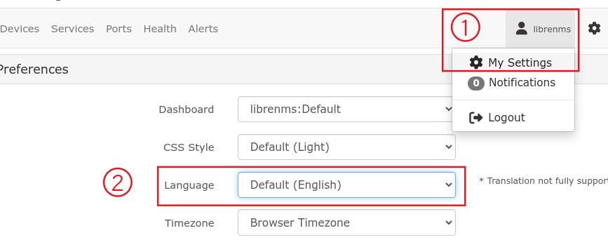

在全域設定裡面，有個【指定URL】（base url），建議先清空。如果主機有正式 domain name，再填入完整網址。 在執行過程中如果發現某個功能會跳到不正確的網址，就表示是這裡的 base url 設定有錯誤。

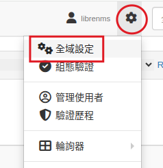
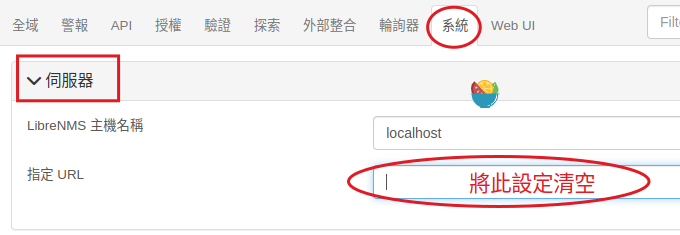

## 2. 新增 snmp 裝置

安裝 librenms 的機器機本身就是一個網路裝置，所以在安裝 librenms 過程中，我們已經為這臺 linux 主機設定好 snmp 服務。所以我們第一步就先將本身的機器加入 librenms 監控。

要新增 snmp 裝置，使用上方選單的【裝置/新增裝置】

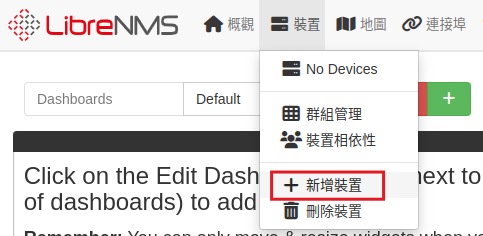


接著填入要受控的裝置 ip ( ipv6 也可以)、 udp( 如果使用ipv6則請改選擇 udp6)， community 填入自己設定的社群名稱，community  留空白表示就是  public。

這裡我們將 ip 填入 localhost ，按下 ++Add Device++ ，先讓 nms 監控自己這台主機。

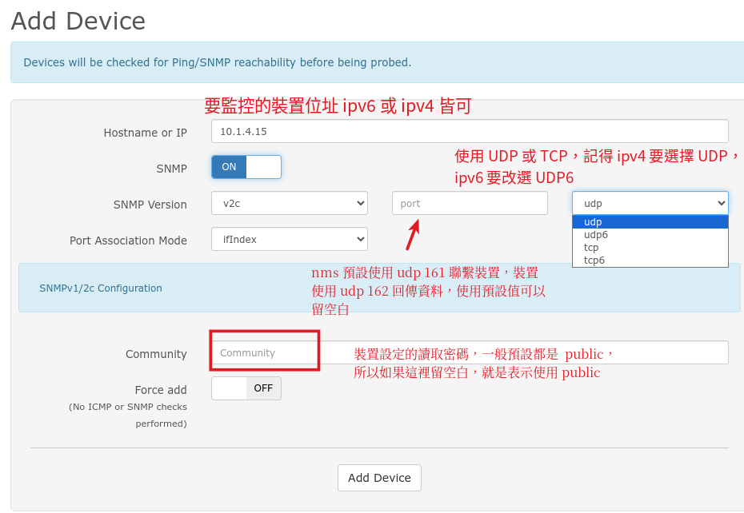

>[!tip]
>建議先使用 ping 測試是否 ping 的到要受控的裝置。 如果 ping 不到表示機器未開機或是連線受阻擋。我們也可以在加入裝置裝置時，勾選「Force add」，這樣 Librenms 就不會做連線測試，會強制加入這個裝置。

如果還知道其他防火牆或是網管型交換器的 ip 跟 community，也可以一台一台手動加進來。

我們可以執行上方選單【裝置/所有裝置】，就可以看到所有受控的裝置。剛加入的裝置因為 librenms 還未輪詢收集資料，所以要稍等幾分鐘才可以看到一些資料。

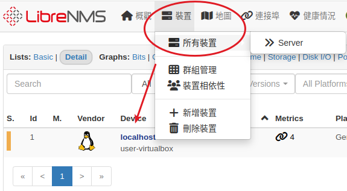


## 3. 已加入的裝置設定

每台受控裝置，我們還可修改一些這臺裝置的設定。例如要顯示的名稱，機器的位置...

進入每臺機器的頁面，點選右側的齒輪圖示，可以進入裝置的設定頁面

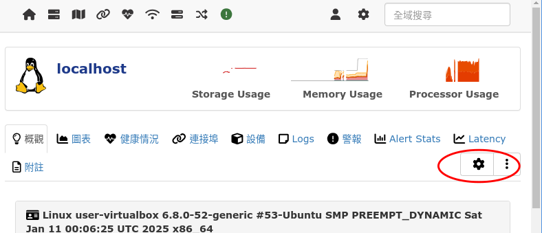

其中確認裝置的類型，還有複寫機器放置的位置 sysLocation，對於管理會有很大的幫助，建議這兩個部份資料正確。

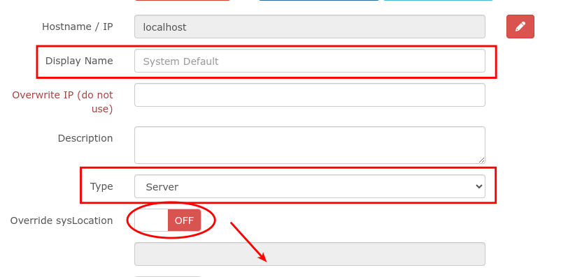

>[!Tip]
>位置可以簡單的設定用來識別的名稱外，還可以在後面加上座標（可以使用 Google地圖點選位置就會顯示座標），座標是使用[ , ]  EX：A5F機房 [24.137224,120.699388]

## 4. 自動探索加入裝置

要一台一台加入受控裝置實在太麻煩，所以 librenms 有提供一些自動探索加入裝置的機制，這個機制預設是6小時會執行一次(新增的裝置5分鐘後會使用自動探索一次)。

首先要先做一些必要的設定。


### 4.1. 【探索/一般探索設定】
因為交換器的 snmp 可能 sysName 是空白沒有設定，所以要允許 sysName 可以重複，不然就沒辦加入相同名稱的裝置。

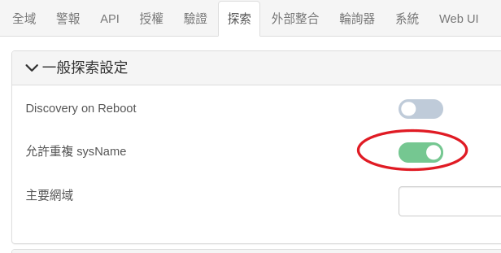

### 4.2. 【探索/網路】
要掃描的 ip 範圍，這邊要注意如果是要探索 10.1.x.x 的所有位址，網域寫法一定要是 10.1==.0.0==/16 ，前面網址如果不是 .0.0 探索會出現錯誤
 
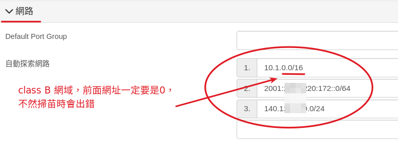

### 4.3. 【輪詢器/SNMP】
community 如果只有 public 這邊就不用新增，如果有自訂的 community ，要在這裡新增，這樣才能成功加入新裝置
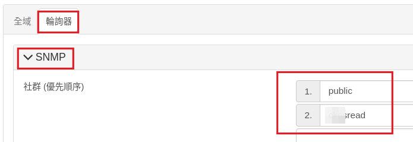

4.自動探索會要求設備要有主機名稱（dns 要設定），預設不使用 ip 增加裝置，所以我們還是必須要去編輯設定檔。 

編輯設定檔

```
sudo -u librenms nano /opt/librenms/config.php
```
在設定檔加上以下這一行
```
$config['discovery_by_ip'] = true;
```
以上設定好， librenms 就會自動探索其他裝置。 

## 5. 手動 snmp 掃描
自動探索是利用受控裝置內的資訊去探索其他裝置，不是把整網域都掃一遍嘗試加入。我們可以使用手動掃描整個網域的 snmp 來強制更新裝置。

只要在 /opt/librenms/ 目錄下，執行 #snmp-scan.py -v 即會手動掃描前面自動探索設定的網域

```bash
cd /opt/librenms/
sudo -u librenms ./snmp-scan.py -v 
```

> [!warning]
>snmp-scan.py 這個程式非常佔用記憶體 ，建議不要一次掃太大範圍的網域。我們也可以手動指定要掃描的網域範圍例如 10.1.4.0/24 就改用下列指令
>```bash
>cd /opt/librenms/
>sudo -u librenms ./snmp-scan.py -v 10.1.4.0/24
>```

## 6. 僅 ping 監控裝置

如果裝置沒有支援 snmp ，但是希望還是能監控裝置是否斷線(例如 ipcam ...)，我們可以使用定期 ping 裝置看看有沒有回應的方式來監控。

只要在新增裝置時，停用 snmp 選項，即可加入「僅 ping 裝置」：
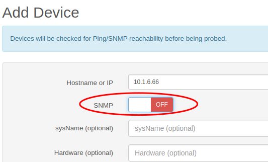


## 7. 裝置群組

除了預設已經將裝置一類型分類外，我們可以將裝置分成不同群組，方邊我們一次觀看分組的裝置。另外針對不同登入的使用者，我們也可以利用裝置的群組，來給予使用者監看的權限。
對於警報規則，也可以依照群組來分類是否觸發警報，或是依群組傳送到不同傳送器。

群組管理功能在主選單【裝置/群組管理】

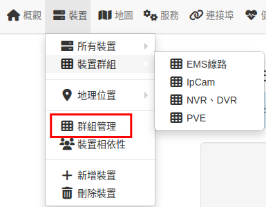


### 7.1. 靜態群組

手動將裝置一台一台加入某群組，就稱為靜態群組。

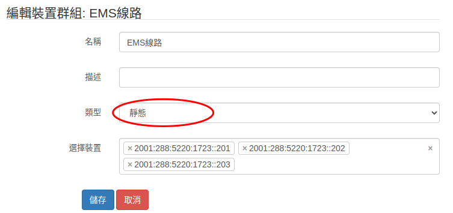

### 7.2. 動態群組

我們也可以利用一些條件設定，動態將裝置分組，省掉一台裝置一台裝置加入群組。分類規則是使用儲存在 MariaDB 資料庫中的表格「欄位名稱」做規則設定。

以下示範要將「僅 ping 裝置」加入 ipcam 分類，則 rule 設定方式如下圖：

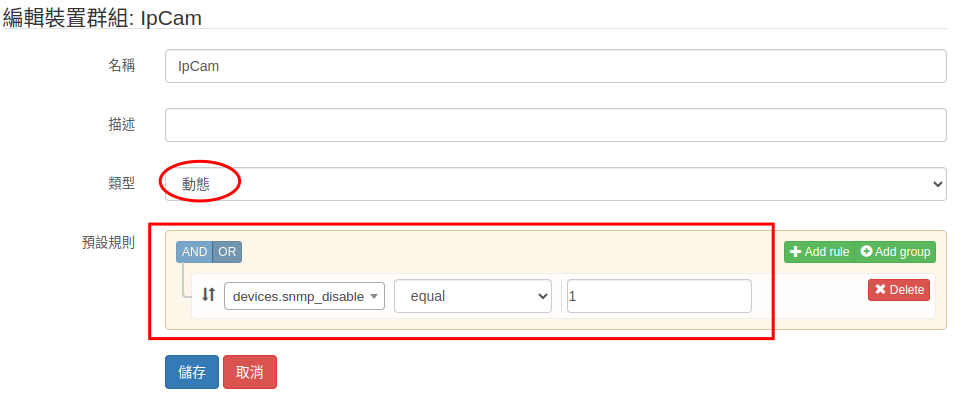

動態群組可以幫我們快速分組，如果還希望能做更細微設定，我們可以先用動態分組設定條件，**先按下儲存後 Librems 就會進行規則分組。**

之後再進來編輯群組設定，將上方的類型由「動態」改選為「靜態」，這樣利用動態分組加入的裝置會保留，我們就可以依照靜態分組的分式，手動增刪裝置，做更細微的微調。


