# Librenms 常用應用介紹

## 1. 單主機訊息

隨意連進一個受控的交換器，可以看到有關此裝置的很多資訊。

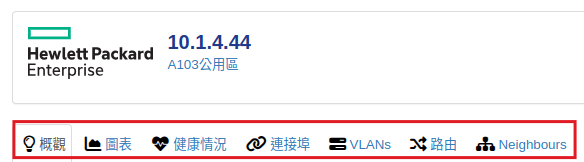

### 1.1. 概觀

顯示裝置的常用資訊、設備類型、型號、CPU負載... 其中  **Overall Traffic** 整體流量就是所有網路孔互相傳輸的總流量，對交換器來說也就是 **「背板流量」** 。

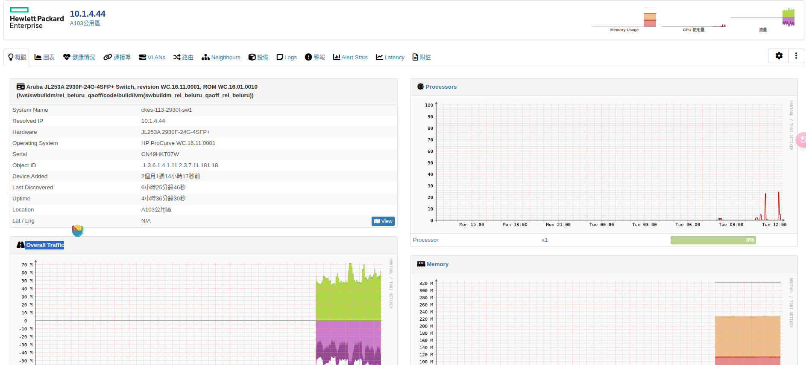

### 1.2. 健康狀況

與裝置體質相關的圖表，例如處理器負載、溫度、記憶體使用率、風扇速度、POE交換器的輸出功率（耗電量）、印表機墨水存量...等。 這些圖表都有長期、短期的趨勢紀錄，所以可以很容易觀察到一些長期性狀況或是網路架構的瓶頸。

### 1.3. 連接埠

交換器或裝置網卡的網路孔資訊，此選單下面還有更多子選單功能

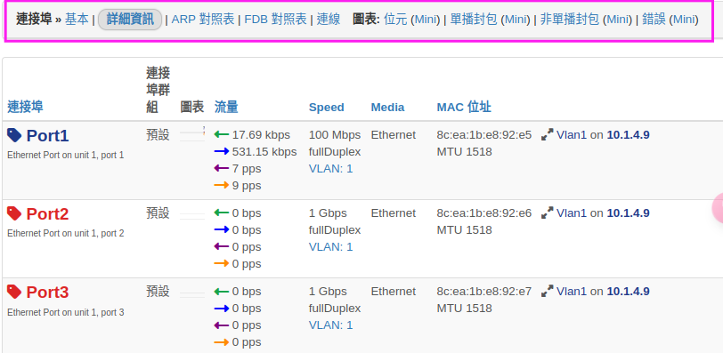

#### 1.3.1. 連接埠-ARP 對照表

L3 用來紀錄 ipv4 跟 mac address 的對照表。所以交換器、電腦、router只要有封包通過，就會快取 ipv4跟 mac address 的對照資料，因為會更新快取，所以留存時間不長(通常約5分鐘)，如果電腦未連線，可能就查詢不到。
這裡的功能就是可以直接彙整所有受控交換器上面的 ARP Table，不用一台一台去個別交換器的 arp table 尋找。

#### 1.3.2. 連接埠-FDB 對照表(forwarding database) table

L2 交換器會紀錄哪個 port 通過封包的 mac address，以及方向。 FDB 是 mac address 對應哪個孔的快取對照表。

> [!info]
> 總結來說， ARP Table 是 ip對應 mac address的快取，通常存在 L3 交換器或各種作業系統， FDB 是 mac address 對應哪個孔的快取，存在交換器。

#### 1.3.3. 連接埠-圖表

個別連結埠的流量統計，觀察網路頻寬是否足夠，特定時間(例如下班後)　是否有不正常的傳輸，經由觀察這些統計圖表，可以幫助網路規劃或改善。

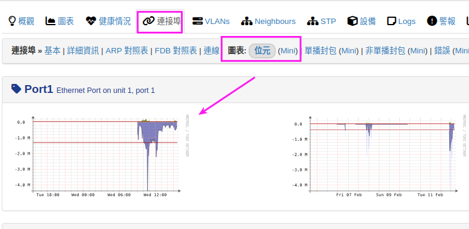

點擊某個圖表，可以更詳細的挑選要顯示的統計區間，依照區間會自動計算最高流量，平均流量，還有傳輸的資料量。

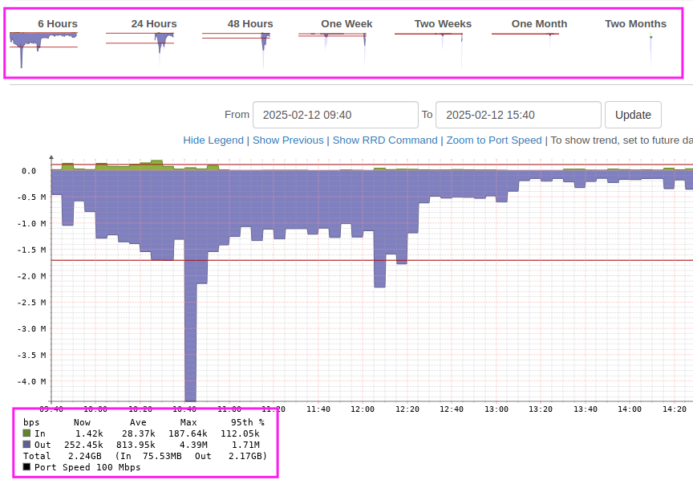

### 1.4. Neighbours

Neighbours 功能可以看到這個交換器，哪個 port 直接連到哪個網管型交換器。這可以使用清單(List)或是地圖(Map) 的方式呈現。有這功能就不用爬樓梯看機櫃，可以馬上知道實際交換器的連線架構。不過這個功能是使用 LLDP 協定，由交換器互相交換一些資訊，這些資訊有很多原因**顯示的連線資訊可能存在一定的誤差，需要結合其他方法進行驗證。**

#### 1.4.1. List

如下清單，表示此交換器的 1 port 連到遠端 5130::1 的第 28 port，此交換器的 port 2 連到遠端 5130::3 的第 28 port。
另外可以看到第16port，遠端卻顯示有兩台設備，這表示本地 16 port 後面有連接非網管型交換器，該交換器後面又連接 .49 跟 .41 這兩台網管型設備。
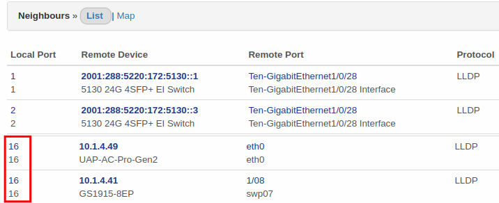

#### 1.4.2. Map

case1: 一般樣式，可以注意下圖連線有箭頭。要注意看連線的箭頭，這連線是從 .8 到 .9，上面的文字從左至右表示是　.8的 Port24，連接到　.9的 port 23。
不是文字靠近那邊就是指哪邊的 port，這部份要特別注意。

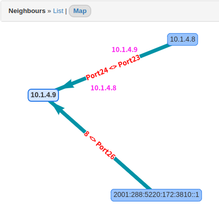

case 2:
有看到一個怪怪的圈圈嗎？ 沒錯就是 Loop 了。

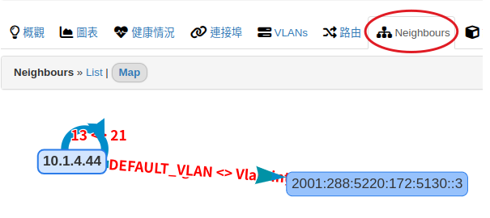

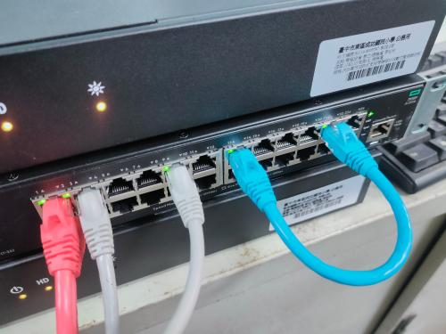

## 2. 主選單功能

上方主選單大部分就是將原本單一主機內的資訊，一次彙顯示所有主機資訊來顯示。依據不同應用，有時候觀看全體資訊比較方便，有時要進入單一主機觀看該主機資訊比較方便，要依照需求來彈性應用。

例如每台交換器都有 ARP Table，我們可以用主功能選單的【概觀/ARP Table】顯示所有對照表，方便我們用 ip 搜尋 mac address。

### 2.1. 推薦功能

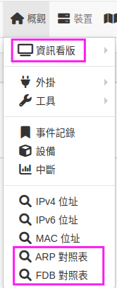

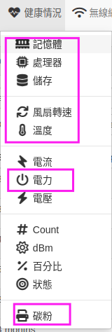

### 2.2. 地圖(Map)/網路

單一裝置的 Neighbours/Map 可以看到單一裝置的接線裝況，這個功能就是把所有連線狀況一次呈現。

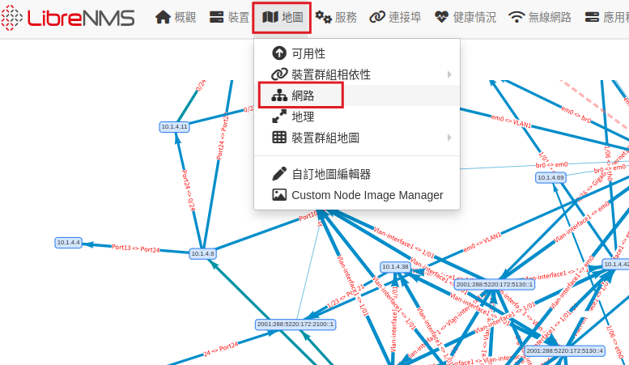

## 3. Q1: 實務應用-尋找網路裝置在哪裡？

假設要找目前 10.1.9.210 這台裝置在哪邊，先使用 arp 查詢找到他的 mac address

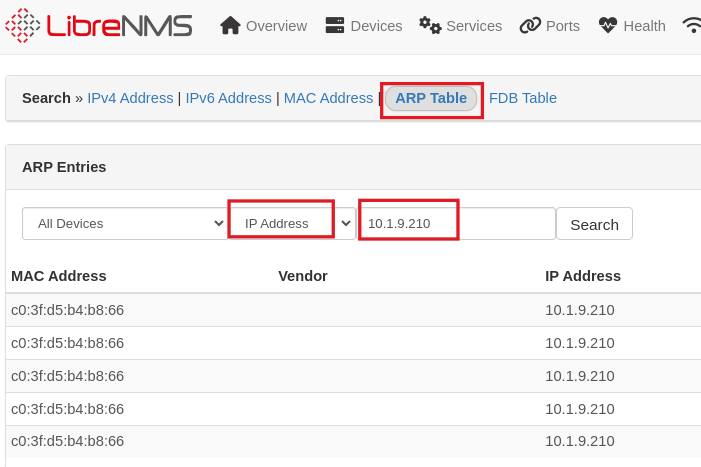

接著使用 FDB 查詢，填入 mac address 查詢，會查詢到很多交換器的 port 都有通過這個 mac address的封包，可是有一個 port 每次進出的封包，都是這個 mac address，所以 librenms 就猜測，這個裝置應該就是直接接在 10.1.4.6 這台交換器的 port8 上。
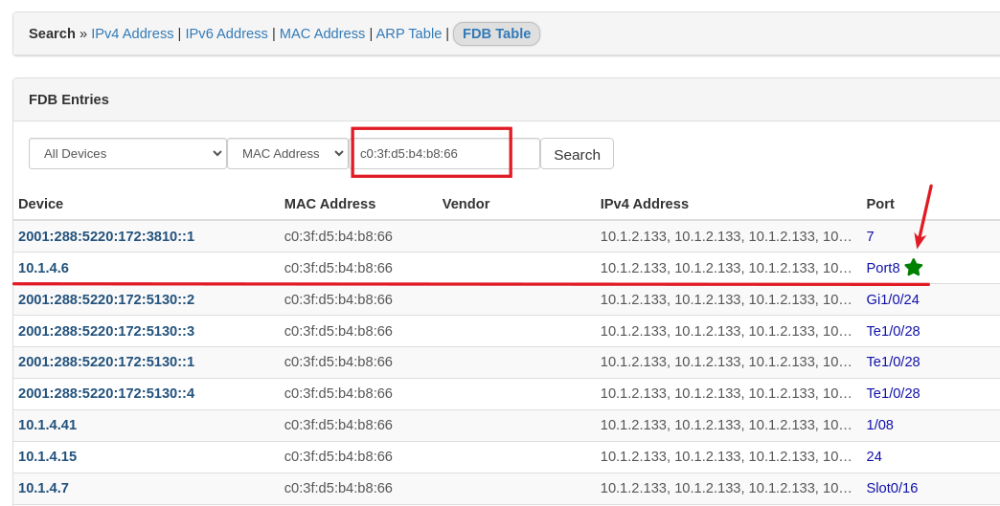

不過這個裝置需要接在網管型交換器上面，才查詢的到，所以如果沒有查詢到綠色星號，表示這個裝置中間可能還有接到一般非網管交換器。

## 4. Q2:確認對外頻寬是否足夠

NMS 管理的是機器，對於交換器而言，我們可以觀察到的是某個網路孔(port)經過的封包方向跟流量，所以對於網路孔是==沒有==「上傳、下載」的概念的，如果這網路孔接的是我們對外的網路線，那**流出（離開）** 這個孔的封包，對我們內部而言就是上傳的流量。 **流入** 這個孔的封包，對我們內部而言就是下載的流量。
依此類推，如果這個**交換器**的網路孔(port)接的是某台電腦，那離開的封包對後端電腦而言，就是下載，進入這個 port 就是上傳。
