# 警報傳送器

裝置離線或是溫度過高， LibrenNMS 可以發出警報提醒，除了顯示警報在 LireNms 界面外，還可以使用多種通知方式 ex: mail、sms、telegram 通知網管，以下將介紹使用 telergam 或 mail 來傳送警報訊息，要主動傳送警報，有四個部份需要設定:

1. **警報傳送(器)**： 設定 librenms 要怎麼傳送訊息（以下示範使用 telegram）以及傳給誰？
2. **警報操作**: 設定多久開始傳？傳幾次？傳給誰？
3. **警報範本**： 發生事件時要傳送的內容範本
4. **警報規則**： 什麼事件（條件）會觸發警報

以上步驟必須依次設定，例如一定要先有「傳送器」（怎麼傳）、 「警報操作」（傳幾次、傳給誰）、「警報範本」（傳送什麼內容）。
「警報規則」（發生什麼事件時，選擇進行什麼「操作」跟使用什麼「範本」。

以下傳送方式，僅需要挑選想使用的通知方式即可。

寄送 mail 可以在本機安裝 postfix 直接寄送郵件，或是使用 SMTP 連到現存的電子郵件的伺服器寄送（以 Gmail 為例）。

## 1. mail傳送器（使用 postfix）

### 1.1 安裝 postfix

如果想簡單的讓 Linux 本機可以傳送 mail ，不用經過任何其他 mail server ，可以安裝 postifx 這個套件。

```Shell title="Shell"
sudo apt update
sudo apt install postfix
```

在安裝過程中，你可能會被要求配置 Postfix。通常，你可以選擇「**Internet Site**」作為你的郵件伺服器類型。
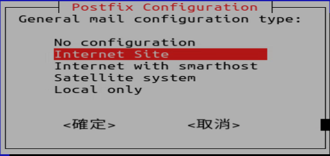

**System mail name (系統郵件名稱)**：這裡輸入你的伺服器完整網域名稱 (FQDN)，例如 `yourdomain.com`。如果你沒有自己的網域，可以使用伺服器的 IP 位址或主機名稱，通常直接按 Enter 就可以。

### 1.2 【全域設定/警報/電子郵件設定】

在 Librenms 的【全域設定/警報/電子郵件設定】，將發送郵件的方式設定為　使用 mail 指令:

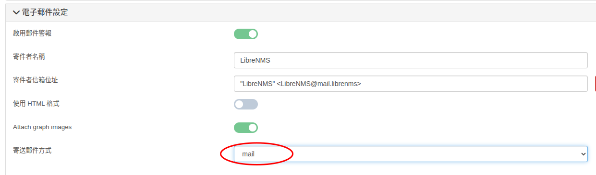

### 1.3 新增 mail 傳送器

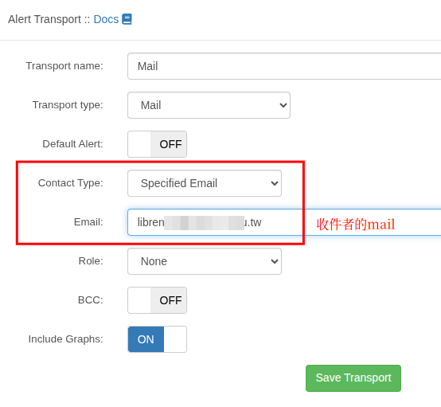]

建立好之後，可以先測試一下是否可以正常傳送成功
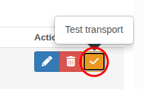

## 2 mail傳送器（使用 Gmail 應用程式密碼 + SMTP 傳送）

1. 首先到 gmail 的帳戶設定頁面，必須要先開啟「　**兩步驟驗證** (Two-factor authentication (2FA))」才會有 **「應用程式密碼」** 的功能
2. 在 Gmail 的帳戶設定，使用搜尋「應用程式密碼」（網頁似乎已經找不到此功能的連結，所以要直接用搜尋才能找到）

3. 新增一個應用程式，取名為 Librenms ，Google 就會產生一個應用程式密碼，這個密碼只會顯示一次，所以要自己保存起來。

4. 中間顯示的密碼，總共連續16個字元，如果使用複製功能，記得要把**中間的空白都刪除，才是正確的密碼**

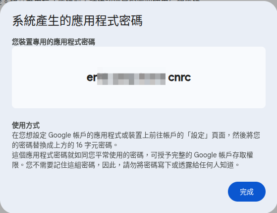
這個密碼就是用來給一般應用程式登入你的 mail 寄信用，避免某些系統直接知道你的 gmail 密碼。

4.　在 Librenms 的【全域設定/警報/電子郵件設定】，將發送郵件的方式設定為　SMTP，然後依下列方式設定， mail 請改成自己的 mail

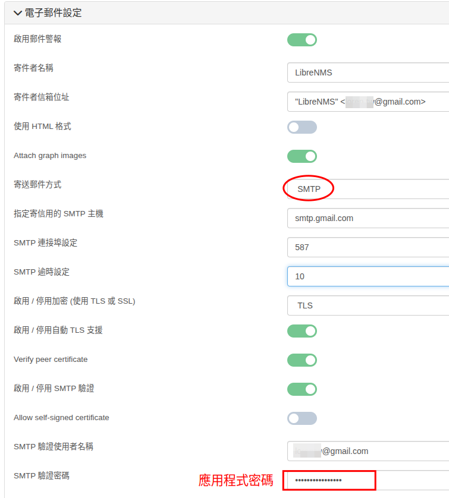

## 3. Telegram 傳送器

### 3.1 telegram 安裝及中文化

可先參考以下網頁，安裝 telegram [telegram 安裝及中文化](https://www.pkstep.com/archives/13832)

### 3.2 申請 telegram bot

在 telergram 搜尋 @botfather 這個帳號，然後點入跟這個機器人聊天
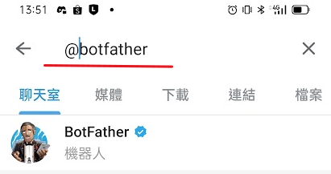

在聊天室打上依序打上以下的內容，就可以取得機器人的 token，請記住這個資訊
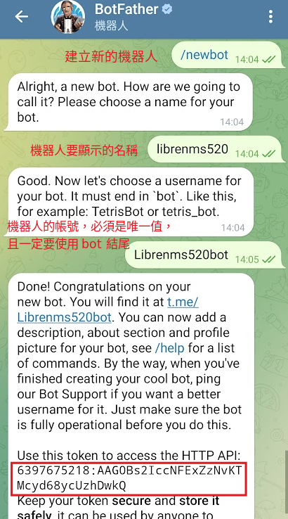

接著我們要取的聊天室 id，我們可以直接跟前面建立的 Librenms520bot 聊天，或是將 @Librenms520Bot 這個帳號加入某個群組，接著使用前面取得的 token 替換以下網址中的<你的token>

`https://api.telegram.org/bot<你的token>/getUpdates`

我們需要的就是回傳資料裡面的聊天室id(chat id)，這個網址只會回傳 @Librenms520Bot 最近聊天的那的對話或是群組的 chatid，所以如果回傳的資料是空的，表示近期沒有 @Librenms520Bot 所在的群組有對話，請先在群組中隨意傳一些訊息，再重新連結以上網址。

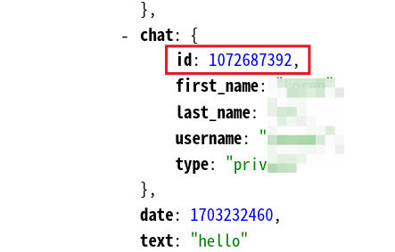

### 3.3 建立 Telegram 警報傳送器

1.  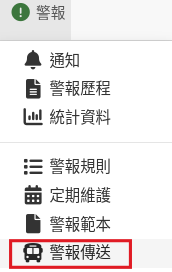
2.  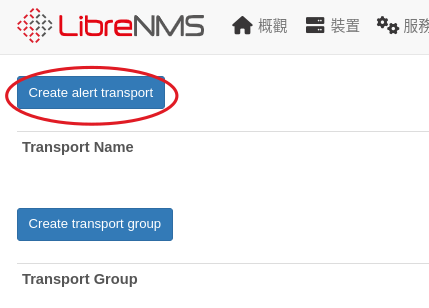
3.  傳送器類型選擇：telegram。 填入前面取得的 chat id 跟 token，格式可以選擇 HTML 也可以順便設定為預設的傳送器
    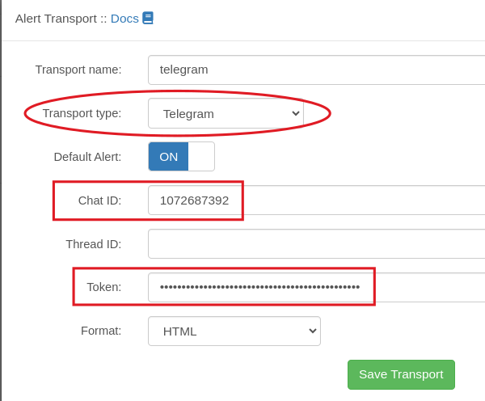
