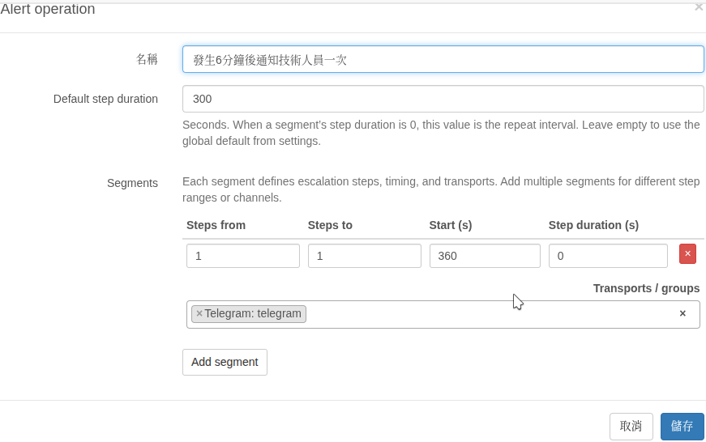

# 警報傳送操作

警報 **操作** 可讓您在多個警報規則中重複使用相同的「通知對象和通知時間」行為。

原本這個設定是寫在每一個「警報規則中」，因為這些行為會一直重複，所以現在被切開來另外設定。

例如事件發生時，傳送通知給技術人員只傳送一次

警報操作可以將警報的傳送分為多個區段，每個區段可以使用不同方式（傳送器）傳送給不同對象，每個區段還可以設定要通知幾次。區段設定是分開的

假設每一步間隔固定為 300秒，則
Default step duration ： 300

---
假設只有一個區段 **Segment (區段)** 時，這裡的 **"Step" (步數)** 可以理解為「第幾次發出通知」。

#### 1. Steps from (起始步數)

- 從第幾次通知開始套用這個規則？    
- 如果你填 `1`，代表從發現問題的第一波通知就開始執行。如果你填 `3`，代表前兩次通知會跳過這個規則，直到第三次才開始。
  
#### 2. Steps to (結束步數)

- 到第幾次通知為止？ `5`，代表這組通知發到第 5 次就結束。
- ***留空 (Empty)：** 代表「沒完沒了」，只要問題沒修好，就會依照這個規律一直發下去。
#### 3. Start (延遲時間 - 單位：秒)

- 觸發告警後，要等多久才開始第一步？ 如果設定 `300`（5分鐘），代表設備斷線的前 5 分鐘它會安靜觀察，如果 5 分鐘內設備自己恢復了，就不會通知你。這能有效過濾掉網路的小波動或是 Librenms 單次輪詢時設備忙碌沒回應，但是下次輪詢就恢復的情況。
   
#### 4. Step duration (步進間隔 - 單位：秒)

- ** **「奪命連環 Call 的頻率」**。如果設定 `3600`（1小時），代表發完第一次通知後，會等一小時才發第二次。0 表示使用預設持續時間。

ex :
    