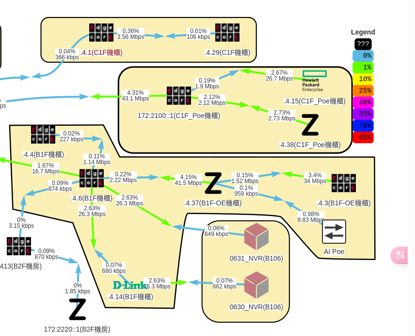
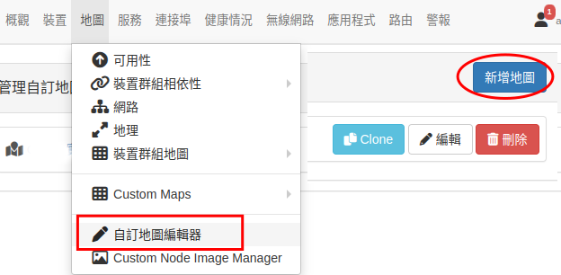
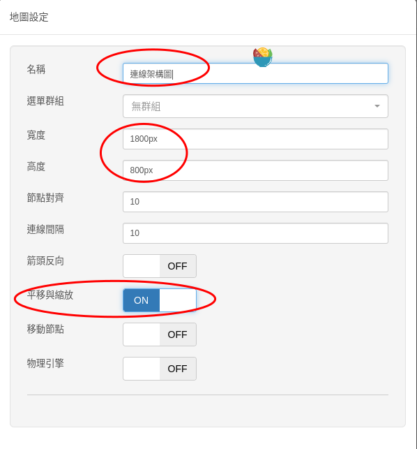
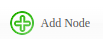
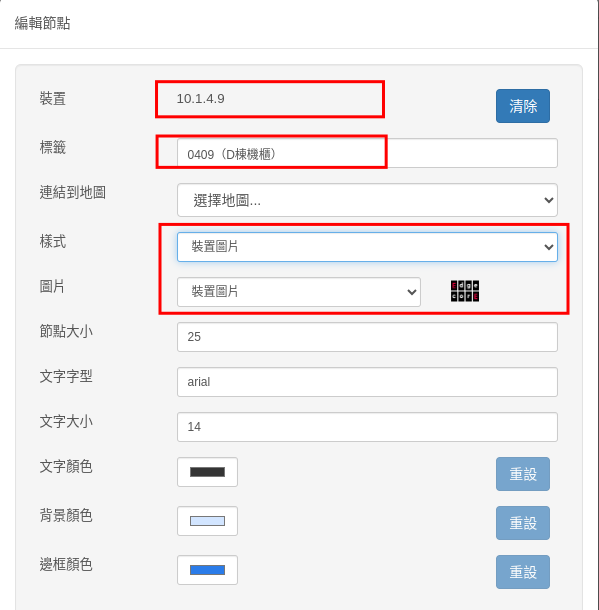
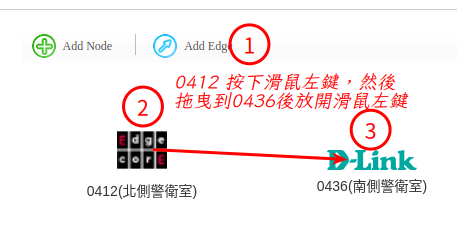
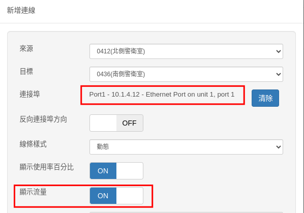
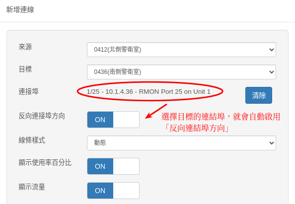
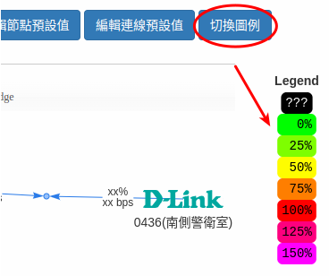
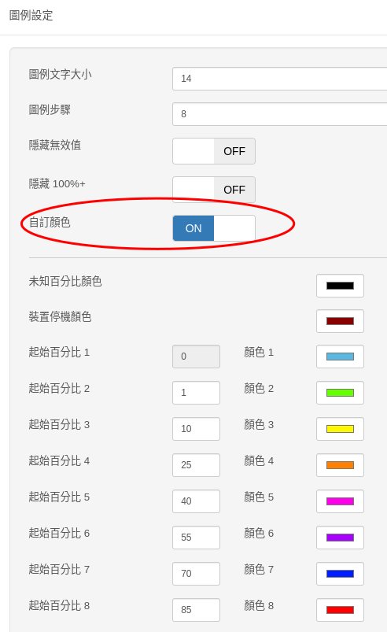

# 自訂地圖

Librenms 已內建新的「自訂地圖」功能，可以讓我們「手動」畫出交換器之間的連線，並且可以「半即時」（因為 snmp 資料預設是5分鐘才會輪詢一次）看到連線之間目前的使用頻寬。
這個地圖對於用來判斷頻寬是否充足，以及連線架構是否須做調整、升級的規劃有很大的助益。

## 1. 新增地圖

執行主選單【地圖/自訂地圖編輯器】，右側上方按下「新增地圖」

自訂地圖會定時更新產生一個圖形檔，所以幾個建議調整的欄位為地圖「名稱」、要產生的圖片寬度、高度。平移縮放選項則是在檢視地圖時，可以用滑鼠縮放及移動檢視位置，這個選項建議啟用。
這些設定都可以隨時做修改。

## 2. 新增節點

進入地圖編輯後，我們按下「Add Node」按鈕，然後在地圖空白處，用滑鼠左鍵點一下，以新增一個節點。

節點指的就是網路裝置（交換器、server...），我們需要設定的主要欄位「裝置」、要顯示的「標籤」
以及要顯示的「節點圖示」。

## 3. 新增連線

以下增加 10.1.4.12 (0412) 及 10.1.4.36 (0436) 兩個節點為例：
首先我們要先知道 0412  跟 0436 之間的實體連線假設 **0412 的 port1 連接到 0436的 port 1/25** (不同交換器的 port 表示的方式都不太相同)。 也就是說在取得連線的頻寬資料時， 0412 的 port1  跟 0436的 port 1/25 取到的資料是一致的，差別只在於兩個資料的傳輸方向剛好相反。 也就是 0412 port1 輸出，就是 0436的 port 1/25 輸入。

接著按下「Add Edge」 按鈕，然後從 0412 拖曳到 0436，拖曳的順序會影響等一下設定中關於方向的設定。

接下來我們只要在連結埠欄位選擇 0412 的 port 1 即可。

因為我們是從 0412 拖曳到 0436 ，如果我們連結埠選擇 0436 的 port 1/25 也是可以的，當我們選擇 0436  的 port 時，下方的「反向連結埠方向」會自動啟用

## 4. Legend 圖例

使用上方「切換圖例」按鈕可以顯示連線使用頻寬的圖例顏色，預設的圖例區間範圍有點大，所以不容易有機會顯示出使用頻寬的差異，建議可以適情況將區間調整小一點。

在圖例上雙擊滑鼠，就可以編輯圖例的設定。勾選自訂顏色，就可以更改圖例顏色以及各顏色的區間範圍。 

