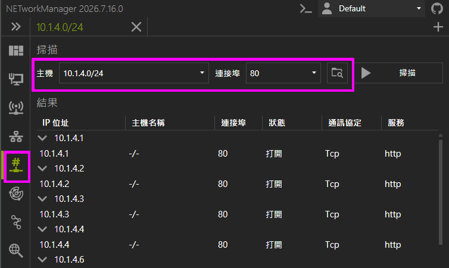

# 軟體推薦&常見問題

::: details Q: 網路管理常用工具推薦
各種網路工具，例如 ping、tracerouter、whois、arp scan... 工具的 gui 界面管理工具

- Linux環境： [NMLinux](https://github.com/thongor77/nmlinux)
- Windows環境：[NETworkManager](https://github.com/BornToBeRoot/NETworkManager)
  :::

::: details Q:網管系統推薦

- 防火牆: [Opnsense](https://opnsense.org/)
- 日誌收集伺服器： [Graylog](https://graylog.org/)
- 網路裝置管理: [Librenms](https://www.librenms.org/)
- DHCP Server: 防火牆使用 Opnsense 則內建的 dhcp server 最好用，靜態綁定 dhcp 外，還可以順便開啟 **ip鎖mac（靜態 ARP）** 功能，不用設定兩次。如果想要單獨的 dhcp 功能，推薦 [Adguardhome](https://github.com/AdguardTeam/Adguardhome) ，不是 Adguardhome APP，APP 是要錢的， server 版本是 opensource，用途不同。
  :::

::: details Q:如何得知網管交換器 ip
如果已經上線的網管交換器不知道 ip，通常網管型交換器（或很多網路裝置）都會使用 dhcp，所以我們可以掃描可能的網段，以及指定 80port，就可以知道哪些 ip 有提供 web 界面，可以連進去看看大概就可以得知那是什麼裝置（順便可以看看有沒有奇怪的裝置提供 web 界面）。

交換器預設帳密，可以去搜尋該型號的說明手冊，裡面應該就會有預設帳密的資訊。

:::
