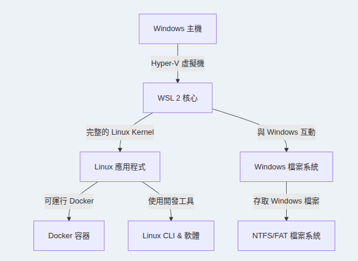
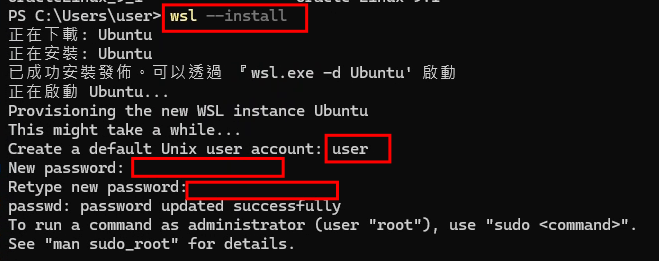
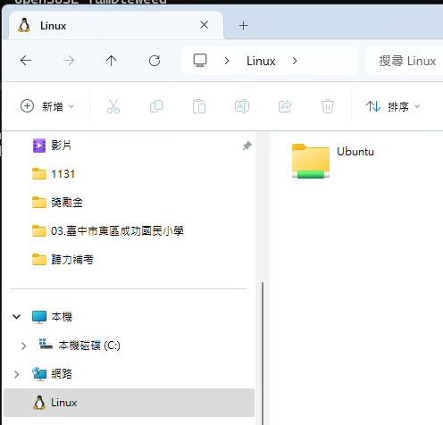
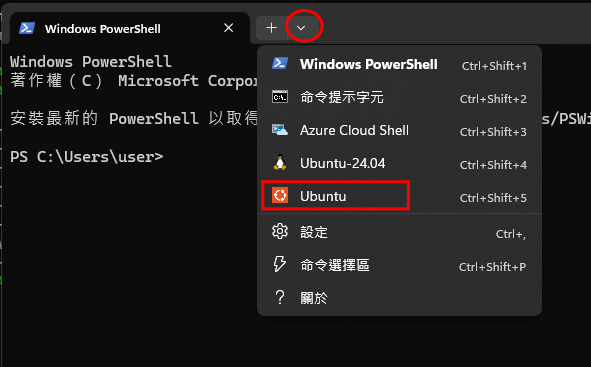
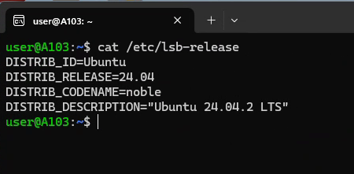
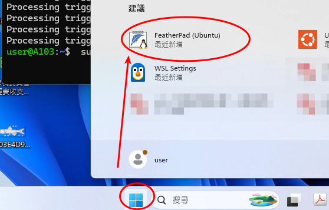

# WSL2 介紹

## 什麼是 WSL2

WSL 2 是微軟於 Windows 10 和 Windows 11 中提供的 Linux 相容層(其實也是一種輕量化虛擬機)，允許用戶在 Windows 環境中運行 Linux 應用程式，而無需安裝虛擬機或雙系統。



## 安裝 WSL2

使用管理者權限開啟 power shell，執行 wsl --install 就會安裝 WSL 核心功能及預設 ubuntu 24.04 作業系統。

```powershell title="powershell"
wsl --install
```

安裝完成會先詢問一個 ubuntu 使用者的帳號跟密碼（要輸入兩次），這裡我們都設定為 **user:user**



開啟檔案總管，可以同時看到 windows 的檔案系統，跟 Linux 的檔案系統。



如果想要開啟 ubuntu 的命令列視窗，只要執行功能表的 ubuntu 程式 或是 powershell 開啟終端機，然後從下拉選單選擇安裝的 OS 名稱，就會進入那個作業系統的命令列。



下方是 ubuntu 24.04 的命令列畫面，在這裡就可以執行一般 Linux 的操作


## WSL 中文環境

在 wsl 在顯示中文會出現亂碼，所以需要安裝中文的環境。
先安裝中文套件跟字型

```bash title="Shell"
sudo apt update
sudo apt install language-pack-zh-hant
sudo apt install fonts-wqy-microhei fonts-wqy-zenhei
fc-cache -f -v
```

接著執行底下命令進行設定：

```bash title="Shell"
sudo dpkg-reconfigure locales
```

選好要支援的語言：建議選取 zh_TW.UTF8
然後我們要讓 wsl 可以使用 windows 內安裝的字型

## 視窗應用程式

WSL 最讓人驚豔的是將 GUI 應用程式直接無縫整合在 windows 桌面中，執行 Linux 中的應用程式，看起來跟執行一般 windows 應用程式沒什麼不同。

我們先在 Linux 中安裝 featherpad 這一套文書編輯軟體

```bash
sudo apt install featherpad
```

安裝完成後， windows 應用程式選單，會出現剛剛安裝的 Linux 程式。


## WSL 常用指令

1. 顯示目前安裝的發行版本以及執行狀態

```PowerShell
wsl -l -v
```

2. 停止所有 wsl 發行版本

```PowerShell
wsl --shutdown
```

3. 安裝預設的發行版本，目前預設是 Ubuntu 24.04

```PowerShell
wsl --install
```

4. 查看可用的線上發行版

```PowerShell
wsl -l -o
```

5.　安裝指定發行版本

```PowerShell
wsl --install -d <Distribution Name>
```

6. 啟用預設發行版本

```PowerShell
wsl
```

7. 執行指定發行版本

```PowerShell
wsl -d <DistributionName>
```

例如 wsl -d Ubuntu 8. 移除指定發行版本

```PowerShell
wsl --unregister <distroName>
```

例如 wsl -d Ubuntu-24.04

## wsl 發行版本備份

**匯出 WSL 發行版**:

```PowerShell title="PowerShell"
wsl --export <Distribution Name> <FileName.tar>
```

**匯入 WSL 發行版**:

```PowerShell title="PowerShell"
wsl --import <NewDistributionName> <InstallLocation> <FileName.tar>
```

範例： wsl --import RestoredUbuntu C:\WSL\RestoredUbuntu ubuntu_backup.tar

## wsl2 鏡像網路模式

> [!Tip]
>
> 1.  發行套件跟 host 之間預設是使用 NAT 模式的網路架構，所以如果 wsl 本身要當作 server 或是 使用 ipv6，傳統虛擬技術是會使用「橋接網路模式」。
> 2.  WSL 有個全新的網路架構稱為「鏡像網路模式」，是將Windows 上的網路介面「鏡像」到 wsl Linux，這時候 Linux 的 ip會跟 host 主機一模一樣。

> [!warning]
>
> 1. 如果使用 Docker Desktop 就不需要使用 wsl 鏡像模式，使用預設的 NAT 模式即可。 Docker Desktop 會針對有做整合的 wsl 發行版本做 port 映射。
> 2. 經實測「鏡像網路模式」的 Linux 內如果使用 docker engine 跑 ipv6， ipv6 連線會不穩定。

1. 執行 【wsl settings】應用程式，切換網路模式為 mirrored
2. 在 powershell 設定 Hyper-V VM 防火牆規則，讓封包可以通過

```PowerShell ttile="PowerShell"
Set-NetFirewallHyperVVMSetting -Name '{40E0AC32-46A5-438A-A0B2-2B479E8F2E90}' -DefaultInboundAction Allow
```
