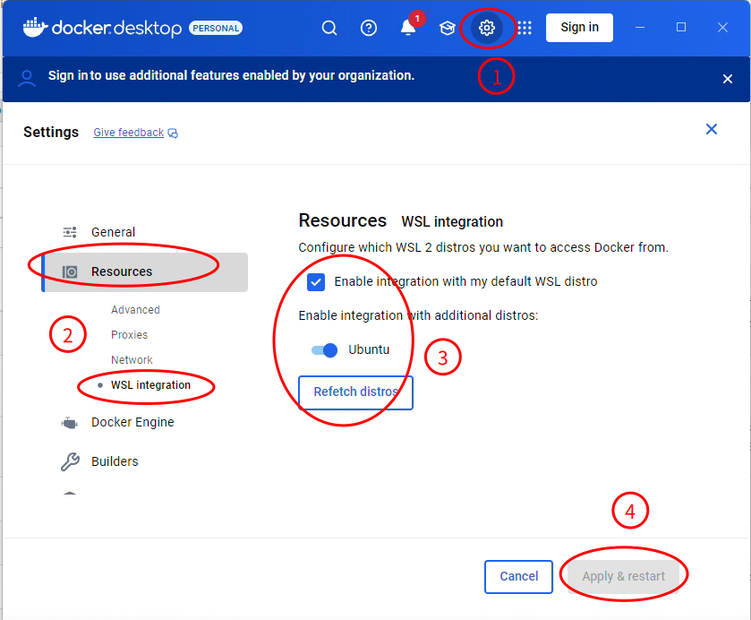
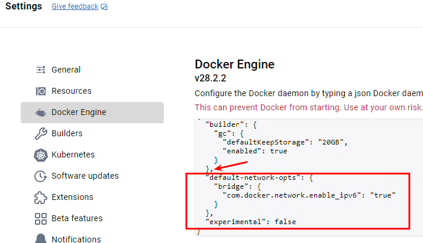

# Docker Desktop

> [!warning]
> 確保你的 Docker Desktop 版本至少是 **4.42 (2025/6/4)**，因為這是原生 IPv6 支援大幅改進的版本。

Docker Desktop 是桌面版的 Docker Engine（核心引擎）視窗管理程式，且可以跟 WSL2 整合，所以建議 Windows 系統安裝 Docker Desktop，這樣就不需要在每一個  WSL Linux環境下安裝 Docker Engine 了。

## 1. 下載安裝 Docker Desktop 

到這裡下載 docker desktop windows 版本，並安裝
https://docs.docker.com/desktop/setup/install/windows-install/

安裝過程保留預設值，登入帳號及問卷都可以直接跳過。

## 2. 設定 WSL2 整合

1.　開啟 Docker Desktop ，進入設定畫面，勾選要整合的 WSL 環境，按下套用，這樣 wsl ubuntu 就不須要安裝　docker engine ，卻可以直接在鏡中執行 docker 指令。


2.　使用 Docker Deskop 最大的好處是網路的整合，我們可以直接在外部網路連線到 Host 的 ip，就可以直接存取到 docker 中的服務，不需要再像以前去設定什麼==橋接、 mirror模式或是連結埠轉發==等功能。

## 3. Docker Desktop 啟用 ipv6支援

開啟 Docker Desktop 的設定，在 Docker Engine 設定黨內，加入以下設定。
```
  "default-network-opts": {
    "bridge": {
      "com.docker.network.enable_ipv6": "true"
    }
  }
```

注意設定檔是 JSON 格式，所以不同列之間要有" ," 分隔。



## 4. 啟動 docker desktop ，之前執行的 container 資料會不見，重新啟動 container 資料又會恢復

A: 以下為 Gemini 解答

當您在 Windows 上使用 WSL (Windows Subsystem for Linux) Ubuntu 和 Docker Desktop 時，遇到這種資料遺失後又恢復的情況，通常與 **Docker 服務的啟動順序**以及 **WSL 檔案系統的掛載**有關。

---

### 4.1. 原因分析

1. **Docker Desktop 的 WSL 2 後端依賴：** Docker Desktop 在 Windows 上運行時，預設會使用 WSL 2 作為其後端。這表示 Docker 引擎、映像檔和容器資料實際上是儲存在 WSL 2 虛擬機器內部的 VHDX 檔案中。
2. **啟動順序的重要性：**
    - **先啟動 WSL Ubuntu 再開 Docker Desktop (正常情況)：** 當您先啟動 WSL Ubuntu 時，WSL 環境會被正確初始化，其檔案系統也會被掛載。此時，Docker Desktop 啟動，就能夠正確地找到並連接到 WSL 2 中儲存的 Docker 資料，因此資料能夠正常取得。
    - **先開 Docker Desktop 再啟動 WSL Ubuntu (資料遺失)：** 如果您在 WSL Ubuntu 尚未完全啟動和初始化之前就開啟 Docker Desktop，Docker 可能會嘗試啟動其 WSL 2 後端。在某些情況下，由於 WSL 檔案系統尚未完全準備好，Docker 可能會暫時性地創建一個**空白或不完整的資料掛載點**。這會導致您看到「資料遺失」的現象，因為 Docker 正在使用一個不正確的資料狀態。
3. **重新啟動 Container 資料恢復：** 當您重新啟動容器時，Docker 會重新嘗試初始化該容器。如果此時 WSL Ubuntu 已經完全啟動並且其檔案系統已正確掛載，Docker 就能夠再次正確地找到並加載原始的容器資料，因此資料會恢復。這不是資料真的丟失了，而是 Docker 在啟動時暫時讀取到了不正確的狀態。

---

### 4.2. 解決方案與建議

為了確保您的 Docker 資料能夠一致且可靠地被讀取，請遵循以下建議：
**優先啟動 WSL Ubuntu：**
    - **最佳實踐：** 始終確保您的 WSL Ubuntu 發行版已經啟動並運行一段時間，然後再開啟 Docker Desktop。您可以在 Windows 的搜尋欄中輸入 "ubuntu" 並啟動它，或者在命令提示字元或 PowerShell 中執行 `wsl` 命令。
    - **檢查 WSL 狀態：** 您可以使用 `wsl -l -v` 命令來查看所有 WSL 發行版的狀態。確保 Docker Desktop 所使用的 Ubuntu 發行版狀態為 `Running`。
    - 
總之，這個問題的關鍵在於 Docker Desktop 對 WSL 2 後端的依賴性。只要確保 WSL 環境在 Docker 啟動前已完全準備就緒，就能避免這種暫時性的資料讀取異常。